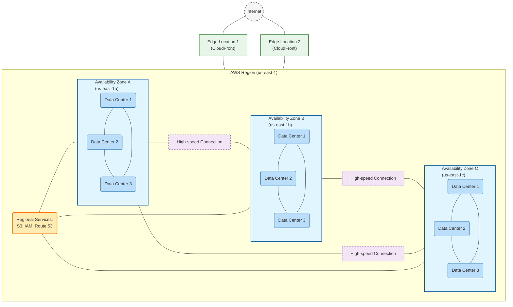
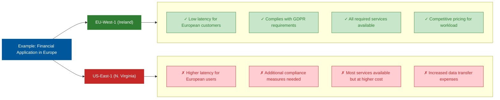
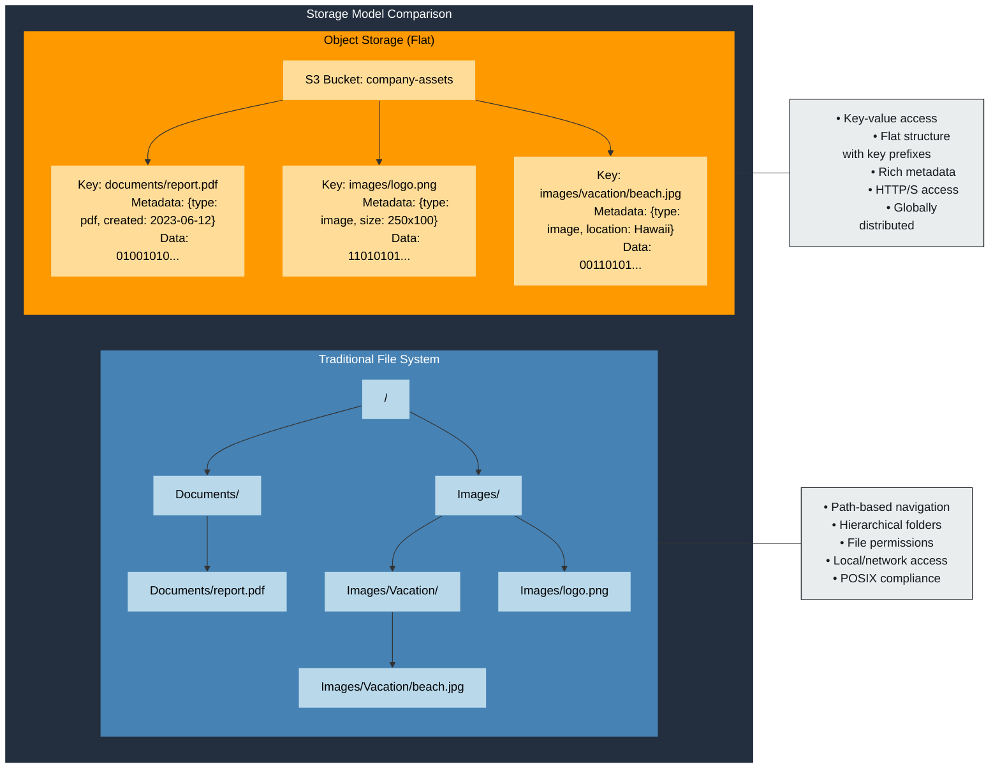

# Chapter 3

 ## Cloud Fundamentals

*The coffee shop was noticeably busier than usual when Ethan arrived for his third session with Maya. She had already secured their regular corner table and was sketching something on her tablet. As Ethan approached, she looked up with a smile.*

------

"I thought we'd switch from napkin sketches to digital today," Maya said, turning her tablet to show a map of the world with various icons scattered across it. "Ready to learn about the AWS global infrastructure?"

"Definitely," Ethan replied, setting down his laptop. "I've been exploring the console like you suggested. There are so many services—it's a bit overwhelming."

"That's why we're starting with the fundamentals," Maya nodded. "Before we dive into individual services, we need to understand how AWS is organized globally and how that affects our architectural decisions."

Maya took a sip of her coffee. "Oh, and I have good news. The product team loves our infrastructure-as-code approach for MagicMail. They've asked us to create a basic asset storage system for their initial designs and mockups using the console first. It's the perfect opportunity to learn about S3 while building something useful for the project, before we automate it with code later."

 ## Understanding AWS Global Infrastructure

"Let's start with how AWS organizes its infrastructure around the world," Maya said, zooming in on her tablet diagram.

*World map showing AWS Regions: https://aws.amazon.com/about-aws/global-infrastructure/*

"AWS has a massive global footprint, consisting of **Regions**, **Availability Zones (AZs)**, and **Edge Locations**. Each **Region** is a separate geographic area, like `us-east-1` in Northern Virginia or `eu-west-1` in Ireland."

"I've heard of regions," Ethan said. "When I configured the AWS CLI, I set my default region to `us-east-1`."

"That's right. A region is essentially a cluster of data centers in a specific geographic location. AWS has regions all over the world—in North America, South America, Europe, Asia, Africa, and Australia."

Maya tapped on one of the regions on her tablet, expanding it to show multiple icons. "Each region consists of multiple, isolated **Availability Zones** or AZs. Think of an AZ as one or more discrete data centers with redundant power, networking, and cooling. They're physically separate within a region—far enough apart that a disaster like a fire or flood affecting one AZ is unlikely to affect others, but close enough to have very low-latency network connections between them (typically measured in single-digit milliseconds)."


*Diagram showing a Region containing multiple AZs, highlighting their separation and interconnection*

"So if there's a power outage in one data center or AZ, our application could still run in another?" Ethan asked.

"Exactly! That's the core idea behind high availability. Distributing your application across multiple AZs within a region is a fundamental best practice for building resilient systems that can withstand failures in a single data center."

Maya zoomed out on her diagram. "AWS also has **Edge Locations**, plus **Regional Edge Caches**. These are points of presence located in major cities around the world, much more numerous than AZs. They are primarily used by services like `Amazon CloudFront`, AWS's content delivery network (CDN), to cache content closer to end-users, reducing latency and improving performance."

"So for MagicMail, we could use CloudFront and these edge locations to make our web application load faster for users across the globe?"

"Precisely. That's part of our plans for the web frontend." Maya smiled, impressed by Ethan's quick grasp of the concept.

 ### Choosing the Right Region

"When building an application like MagicMail, one of our first decisions is which AWS region or regions to deploy our resources into," Maya explained. "This decision affects several key factors:"


*Diagram or list showing factors: Latency, Compliance, Service Availability, Cost*


"Here's what to consider:

> 1. **Latency:** Choose regions physically closest to the majority of your users to minimize delay (latency) in accessing your application. For a global application, you might deploy to multiple regions.
> 2. **Compliance and Data Residency:** Certain laws or regulations (like GDPR in Europe) may require data to be stored within specific geographic boundaries. You need to choose regions that meet these requirements.
> 3. **Service Availability:** While most core services are available in almost all regions, newer or specialized AWS services might launch first in specific regions before becoming globally available. Always check if the services you need are available in your target region.
> 4. **Cost:** Pricing for AWS services can vary slightly between regions. While often not the primary driver, significant cost differences might influence your decision, especially for large deployments."

"For MagicMail, we'll start in `us-east-1` (N. Virginia). It's one of the oldest and largest regions, typically gets new services first, and is a good starting point for serving North American users. However, we'll design our application with multi-region deployment in mind for future expansion."

 ## AWS Service Categories

Maya opened a new diagram on her tablet, showing a hierarchical structure of AWS services. "AWS offers over 200 services now, which can seem overwhelming. Let's break them down into logical categories to make them more manageable."

```mermaid
   flowchart LR
      AWS(["AWS Service Categories"])

      AWS --> Compute["Compute"]
      AWS --> Storage["Storage"]
      AWS --> Database["Database"]
      AWS --> Network["Networking & Content Delivery"]
      AWS --> Security["Security, Identity & Compliance"]
      AWS --> Integration["Integration & Messaging"]
      AWS --> Management["Management & Governance"]
      AWS --> Analytics["Analytics & Machine Learning"]

      %% Compute services
      Compute --> Compute_Services["• EC2 (Virtual Servers)
                                  • Lambda (Serverless Functions)
                                  • ECS/EKS (Container Services)
                                  • Fargate (Serverless Containers)
                                  • Elastic Beanstalk (PaaS)"]

      %% Storage services
      Storage --> Storage_Services["• S3 (Object Storage)
                                 • EBS (Block Storage)
                                 • EFS (File Storage)
                                 • S3 Glacier (Archival Storage)
                                 • Storage Gateway (Hybrid Storage)"]

      %% Database services
      Database --> Database_Services["• RDS (Relational Database)
                                   • DynamoDB (NoSQL Database)
                                   • ElastiCache (In-Memory Cache)
                                   • Neptune (Graph Database)
                                   • Redshift (Data Warehouse)"]

      %% Networking services
      Network --> Network_Services["• VPC (Virtual Private Cloud)
                                 • CloudFront (CDN)
                                 • Route 53 (DNS)
                                 • API Gateway (API Management)
                                 • Direct Connect (Dedicated Connection)"]

      %% Security services
      Security --> Security_Services["• IAM (Identity & Access)
                                   • Cognito (User Authentication)
                                   • GuardDuty (Threat Detection)
                                   • Shield (DDoS Protection)
                                   • WAF (Web Application Firewall)"]

      %% Management services
      Management --> Management_Services["• CloudWatch (Monitoring)
                                       • CloudTrail (Audit Logging)
                                       • CloudFormation (IaC)
                                       • AWS Config (Resource Tracking)
                                       • Systems Manager (Operations)"]

      %% Integration services
      Integration --> Integration_Services["• SQS (Message Queue)
                                         • SNS (Pub/Sub Notifications)
                                         • EventBridge (Event Bus)
                                         • Step Functions (Workflow)
                                         • AppSync (GraphQL API)"]

      %% Analytics services
      Analytics --> Analytics_Services["• Athena (Query Service)
                                     • EMR (Hadoop Framework)
                                     • SageMaker (Machine Learning)
                                     • Kinesis (Streaming Data)
                                     • Glue (Extract, Transform, Load)
                                     • QuickSight (BI Service)"]

      %% Styling
      classDef main fill:#232F3E,color:#ffffff,stroke:#232F3E,stroke-width:2px
      classDef category fill:#0073BB,color:#ffffff,stroke:#0073BB,stroke-width:1px
      classDef services fill:#EAEDED,color:#16191F,stroke:#16191F,stroke-width:1px

      class AWS main
      class Compute,Storage,Database,Network,Security,Integration,Management,Analytics category
      class Compute_Services,Storage_Services,Database_Services,Network_Services,Security_Services,Integration_Services,Management_Services,Analytics_Services services
```

*Diagram showing major AWS service categories*


"At a high level, AWS services fall into these main categories:

 > - **Compute:** Services that provide processing power (e.g., `EC2` virtual machines, `Lambda` serverless functions).
 > - **Storage:** Services that store data (e.g., `S3` object storage, `EBS` block storage for EC2, `EFS` file storage).
 > - **Database:** Managed database services (e.g., `RDS` relational databases, `DynamoDB` NoSQL database).
 > - **Networking & Content Delivery:** Services for defining networks and delivering content (e.g., `VPC` virtual networks, `Route 53` DNS, `CloudFront` CDN, `API Gateway`).
 > - **Security, Identity & Compliance:** Services for securing resources and managing access (e.g., `IAM`, `KMS` encryption keys, `WAF` web application firewall).
 > - **Management & Governance:** Services for monitoring, logging, and managing your AWS environment (e.g., `CloudWatch` monitoring, `CloudTrail` logging, `CloudFormation` IaC).
 > - **Machine Learning, Analytics, Developer Tools,** and many more..."

"Let's focus on the ones we'll use most for MagicMail," Maya continued, highlighting several services on her diagram.

"For compute, we'll primarily use `Lambda`. For storage, `S3`. For databases, `DynamoDB` and `RDS`. For networking and delivery, `API Gateway` and `CloudFront`. And we'll rely heavily on `IAM` for security and `CloudFormation`/`CDK` for management."

"That's still quite a few services," Ethan noted.

"True, but we'll tackle them one at a time, starting with `S3` today. Remember that these services are designed to work together seamlessly, like building blocks, allowing us to create sophisticated applications."

 ## Introduction to Amazon S3

"Now let's talk about Amazon S3, which stands for Simple Storage Service," Maya said, opening a new tab in her browser showing the S3 console. "S3 is one of AWS's oldest and most fundamental services. It's an **object storage** service designed for storing and retrieving virtually any amount of data from anywhere on the web."

 

*Screenshot of the main S3 console page showing a list of buckets*

"What exactly is 'object storage'?" Ethan asked. "How is it different from the file systems on my laptop?"

"Great question," Maya replied. "Traditional file systems (like on your laptop) organize data in a hierarchy of directories and files. Object storage is different. It manages data as **objects**, where each object consists of the data itself, metadata (descriptive information about the data), and a unique identifier (the object key)."

Maya drew a quick comparison on her tablet:

 *Diagram comparing a tree-like file system structure to a flat object storage structure with buckets and objects*

"Instead of complex directory trees, S3 uses a flat structure based on **buckets**. A bucket is a container for objects. You can think of it like a top-level folder, but bucket names must be **globally unique** across all AWS accounts. Inside buckets, you store your objects. While you can use prefixes and delimiters (like `/`) in object keys to simulate folders for organizational purposes (e.g., `images/dragons/red-dragon.png`), S3 itself sees it as a flat structure within the bucket."

"S3 is designed for extreme durability and availability. AWS automatically stores copies of your S3 data across multiple physical facilities (within the AZs of your chosen region) to protect against data loss. S3 Standard is designed for **99.999999999% (eleven 9s) durability** of objects over a given year. That means if you store 10,000 objects, you could expect to lose one object every 10 million years on average!"

"That sounds incredibly reliable," Ethan remarked.

"It is. S3 is also designed for high availability, meaning your data is readily accessible when you need it. It's built to handle massive scale and concurrent access. It's one of the most robust storage systems available."

"How do you organize data in S3?" Ethan asked again, wanting to solidify the concept.

"As I mentioned, data is organized into **buckets**. You create buckets, and then you upload **objects** (your files) into those buckets. Each object has a **key**, which is its unique name within the bucket (including any 'folder' prefixes like `images/dragons/red-dragon.png`)."

Maya opened her browser's developer tools. "For example, if you had a bucket named `magicmail-assets-dev-unique123` in the `us-east-1` region and uploaded an image with the key `images/dragons/red-dragon.png`, the S3 URI path would look like:"

 ```bash
 s3://magicmail-assets-dev-unique123/images/dragons/red-dragon.png
 ```

"And if the object was made publicly accessible (which requires specific permission settings), its HTTP URL might look something like:"

 ```bash
 https://magicmail-assets-dev-unique123.s3.us-east-1.amazonaws.com/images/dragons/red-dragon.png
 ```

"Though often, for public content, we'd serve it through `CloudFront` for better performance and potentially lower cost."

 ### Key S3 Concepts

"Before we create our first bucket, let's cover some key S3 concepts," Maya said, bringing up a new slide on her tablet.

 ```mermaid
 flowchart LR
    S3["Amazon S3"]
    
    S3 --> Bucket["Bucket (Container for objects)"]
    Bucket --> BucketDetails["• Globally unique name
    • Region-specific
    • Unlimited objects
    • 100 bucket soft limit per account"]
    Bucket -.-> BucketEx["Example: magicmail-assets"]
    
    S3 --> Object["Object (File + Metadata)"]
    Object --> ObjectDetails["• Data (file content)
    • Metadata (system & user)
    • Up to 5TB per object
    • Versioning support"]
    Object -.-> ObjectEx["Example: dragon.png (2.5MB, image/png)"]
    
    S3 --> Keys["Keys (Object identifiers)"]
    Keys --> KeyDetails["• Unique identifier within bucket
    • Resembles file paths
    • Used in URLs
    • Max length: 1024 bytes"]
    Keys -.-> KeyEx["Example: images/dragons/red-dragon.png"]
    
    S3 --> Access["Access Controls (Security)"]
    Access --> AccessDetails["• Bucket policies (JSON)
    • IAM policies
    • Access Control Lists
    • Block Public Access
    • Presigned URLs"]
    
    S3 --> Storage["Storage Classes"]
    Storage --> StorageDetails["• S3 Standard
    • S3 Intelligent-Tiering
    • S3 Standard-IA
    • S3 One Zone-IA
    • S3 Glacier
    • S3 Glacier Deep Archive"]
    
    %% Styling
    classDef main fill:#FF9900,color:#000000,stroke:#FF9900,stroke-width:2px
    classDef concept fill:#232F3E,color:#ffffff,stroke:#232F3E,stroke-width:1px
    classDef details fill:#EAEDED,color:#16191F,stroke:#16191F,stroke-width:1px
    classDef examples fill:#FFDD99,color:#000000,stroke:#FF9900,stroke-width:1px
    
    class S3 main
    class Bucket,Object,Keys,Access,Storage concept
    class BucketDetails,ObjectDetails,KeyDetails,AccessDetails,StorageDetails details
    class BucketEx,ObjectEx,KeyEx examples
 ```

 *Diagram illustrating key S3 concepts*

"We've talked about buckets, objects, and keys. Let me explain a few more important concepts:

 > - **Storage Classes:** S3 offers different storage classes optimized for various access patterns and costs. `S3 Standard` is the default for frequently accessed data. Others like `S3 Standard-IA` (Infrequent Access) or `S3 Glacier` (Archival) offer lower storage costs but may have retrieval fees or longer retrieval times.
 > - **Lifecycle Policies:** These allow you to automate actions on your objects over time. You can define rules to automatically transition objects to cheaper storage classes (e.g., move to IA after 90 days, then to Glacier after a year) or to automatically delete objects after a certain period.
 > - **Versioning:** You can enable versioning on a bucket to keep multiple variants of an object. When enabled, deleting an object adds a delete marker instead of removing it permanently, and overwriting an object creates a new version. This protects against accidental deletions or overwrites.
 > - **Access Control:** S3 provides multiple ways to control who can access your buckets and objects and what actions they can perform. This includes **Bucket Policies** (JSON documents defining permissions for the bucket), **IAM Policies** (controlling user/role access), **Access Control Lists (ACLs)** (a legacy method, generally discouraged now), and **Block Public Access** settings (global overrides to prevent accidental public exposure).
 > - **Static Website Hosting:** S3 buckets can be configured to host static websites (HTML, CSS, JavaScript, images).
 > - **Encryption:** S3 provides options for encrypting data at rest (using keys managed by S3, KMS, or provided by you) and enforcing encryption in transit (using HTTPS)."

"That's a lot to take in," Ethan said, noting down the concepts.

"We'll explore each as we need them. For today, let's focus on creating a bucket, understanding basic access control, and uploading objects."

 ### Hands-on: Creating an S3 Bucket in the Console

"Now let's create our first S3 bucket for MagicMail's assets using the AWS Management Console," Maya said, navigating to the S3 service in her browser. "This will be where the product team stores their design files, mockups, and other assets during development."

 

 *Screenshot of the S3 'Create bucket' page - General configuration section*

"First, click `Create bucket`. We need to choose a **globally unique bucket name**. Bucket names have specific rules (lowercase letters, numbers, hyphens, dots, between 3 and 63 characters). Let's try `magicmail-assets-dev-[your-initials-or-random-number]`. You'll need to make it unique, so add something specific to you. If the name is already taken, AWS will tell you when you try to create it."

"Now, choose the **AWS Region** where the bucket will reside. We'll use `us-east-1` as we discussed earlier."

"Next, there are several configuration options. Let's review them:"

 

 *Screenshot of the 'Object Ownership' section, showing 'ACLs disabled (recommended)'*

"For **Object Ownership**, we'll leave it at the default and recommended setting: `ACLs disabled`. This simplifies permissions management, relying solely on IAM and bucket policies."

 


*Screenshot of the 'Block Public Access settings for this bucket' section, showing all boxes checked*

"For **Block Public Access settings**, we'll keep all the blocks enabled for now. This is the most secure default setting and prevents any accidental public access to our bucket or objects. We would only disable specific blocks if we had a clear use case, like hosting a public website."

 

 *Screenshot of 'Bucket Versioning' and 'Default encryption' sections*

"Let's **enable Bucket Versioning**. This is highly recommended for protecting data against accidental deletion or modification."

"For **Default encryption**, we'll leave it at the default `Amazon S3 managed keys (SSE-S3)`. This ensures all new objects uploaded to the bucket are automatically encrypted at rest."

"We won't set up any **Tags** right now through the console, but tags (key-value pairs) are very useful for cost allocation, automation, and resource organization in larger environments. We'll add tags later using code."

"Review the settings and click `Create bucket` at the bottom."

 

 *Screenshot of the S3 bucket list showing the newly created bucket*

"Perfect! We've created our first AWS resource for MagicMail using the console. This S3 bucket will serve as the asset storage for our project."

 ### Understanding S3 URLs and ARNs

Maya opened a text editor. "Let's talk about how to reference our new S3 bucket and the objects within it. In AWS, resources can be referenced in multiple ways."

"First, there's the S3 **console URL** format, which lets you browse the bucket in the web interface. It looks something like this (replace with your actual bucket name and region):"

 ```bash
 https://s3.console.aws.amazon.com/s3/buckets/magicmail-assets-dev-unique123?region=us-east-1
 ```

"Then there's the **S3 URI** used by tools like the AWS CLI:"

 ```bash
 s3://magicmail-assets-dev-unique123/
 ```

"For specific objects, you append the key path:"

 ```bash
 s3://magicmail-assets-dev-unique123/images/logo.png
 ```

"And as we saw earlier, there's the **HTTP(S) endpoint** for accessing objects directly via the web (if permissions allow):"

 ```bash
 https://magicmail-assets-dev-unique123.s3.us-east-1.amazonaws.com/images/logo.png
 ```

"Finally, and very importantly for permissions and code, there's the **ARN (Amazon Resource Name)**. This is a standardized way to uniquely identify *any* resource in AWS. For our bucket, it would look like this (replace with your actual bucket name and account ID):"

 ```bash
 arn:aws:s3:::magicmail-assets-dev-unique123
 ```

"And for a specific object within the bucket:"

 ```bash
 arn:aws:s3:::magicmail-assets-dev-unique123/images/logo.png
 ```

"ARNs are crucial because they are used extensively in IAM policies and Bucket Policies to grant or deny permissions to specific resources."

 ### Uploading Objects to S3

"Now, let's upload some files to our bucket," Maya said, clicking on the newly created bucket name in the S3 console. "These could be design assets for MagicMail."

 

 *Screenshot of the S3 console view inside the bucket, highlighting the 'Upload' button*

"Click `Upload`. You can drag and drop files or use the `Add files` / `Add folder` buttons."

"Let's create a logical folder structure first. Although S3 has a flat structure, the console and tools use the `/` delimiter to simulate folders. Click `Create folder`, name it `images`, and click `Create folder` again. Do the same for `design-files` and `mockups`."

 

 *Screenshot showing the 'images', 'design-files', 'mockups' folders inside the bucket*

"Now, navigate into the `images` folder and click `Upload`. Let's upload a sample logo file."

 

 *Screenshot of the S3 upload interface with a sample file added*

"You can review properties, permissions, and storage class before uploading. For now, we'll use the defaults. Click `Upload`."

 

 *Screenshot showing the successfully uploaded file inside the 'images' folder*

"Perfect! We've successfully uploaded our first asset to the S3 bucket."

 ### S3 Permissions and Access Control (Brief Overview)

"Let's briefly touch on how to control access," Maya said, navigating back to the bucket level and clicking on the 'Permissions' tab. "This is a deep topic, but it's crucial for security."

 

 *Screenshot of the bucket's 'Permissions' tab*

"As mentioned, S3 provides multiple mechanisms for access control:

> - **Block Public Access:** These are the primary settings (which we left enabled) to prevent accidental public exposure at the account or bucket level.
> - **Bucket Policies:** Powerful JSON documents attached to the bucket itself, defining fine-grained permissions (e.g., allow specific users to read objects, allow a service to write objects).
> - **IAM Policies:** Attached to users, groups, or roles, defining what AWS actions they can perform on which resources (including S3 buckets/objects).
> - **Access Control Lists (ACLs):** A legacy method for object-level permissions (generally avoid unless you have a specific need that policies can't cover).

"For MagicMail, we'll primarily use **IAM policies** (like the `AdministratorAccess` your user currently has, though we'll restrict this later) and potentially **Bucket Policies** for specific cross-account access or service integrations. Since we disabled ACLs, we don't need to worry about those."

"Let's look at where you'd edit the Bucket Policy."

 

 *Screenshot of the Bucket Policy editor section*

"Here you could add a JSON policy. For example, this policy would allow our 'MagicMailDeveloper' IAM user to list the bucket contents and read/write objects:"

 ```json
 {
   "Version": "2012-10-17",
   "Statement": [
     {
       "Effect": "Allow",
       "Principal": {
         "AWS": "arn:aws:iam::ACCOUNT_ID_HERE:user/MagicMailDeveloper"
       },
       "Action": [
         "s3:GetObject",
         "s3:PutObject",
         "s3:ListBucket"
       ],
       "Resource": [
         "arn:aws:s3:::magicmail-assets-dev-unique123",
         "arn:aws:s3:::magicmail-assets-dev-unique123/*"
       ]
     }
   ]
 }
 ```

"**Important:** You would need to replace `ACCOUNT_ID_HERE` with your actual 12-digit AWS account number and `magicmail-assets-dev-unique123` with your actual bucket name. We won't apply this policy now, as your IAM user already has administrative access. In real projects, we'd use much more specific, least-privilege policies defined via IAM and potentially bucket policies, often managed through our CDK code."

 ### S3 Static Website Hosting (Brief Overview)

 "One of S3's powerful features is hosting static websites," Maya explained, navigating to the 'Properties' tab of the bucket.

 

 *Screenshot showing the 'Static website hosting' section on the Properties tab, likely showing it as Disabled*

"If you scroll down, you'll find the `Static website hosting` section. Here, you can enable the feature, specify an `index` document (like `index.html`) and an `error` document. This makes S3 serve your files directly as a website. We'll use this later for MagicMail's frontend, likely in combination with CloudFront."

 ### S3 Storage Classes and Lifecycle Management (Brief Overview)

 "Remember the different storage classes?" Maya asked. "They help optimize costs based on how frequently you access data."

 ```mermaid
 flowchart LR
    S3["Amazon S3 Storage Classes"]
    
    S3 --> Standard["S3 Standard"]
    Standard --> StandardDetails["• Default storage class<br>• 99.999999999% durability<br>• 99.99% availability<br>• Low latency, high throughput<br>• Use: Frequently accessed data"]
    
    S3 --> Intelligent["S3 Intelligent-Tiering"]
    Intelligent --> IntelligentDetails["• 99.999999999% durability<br>• 99.9% availability<br>• Automatic cost optimization<br>• Monthly monitoring fee<br>• Use: Unknown/changing access patterns"]
    
    S3 --> StandardIA["S3 Standard-IA<br>(Infrequent Access)"]
    StandardIA --> StandardIADetails["• 99.999999999% durability<br>• 99.9% availability<br>• Lower cost than Standard<br>• Retrieval fee per GB<br>• Use: Long-lived, infrequently accessed data"]
    
    S3 --> OneZoneIA["S3 One Zone-IA"]
    OneZoneIA --> OneZoneIADetails["• 99.999999999% durability<br>• 99.5% availability<br>• Single AZ storage (less resilient)<br>• ~20% lower cost than Standard-IA<br>• Use: Easily recreatable, infrequent access"]
    
    S3 --> Glacier["S3 Glacier"]
    Glacier --> GlacierDetails["• 99.999999999% durability<br>• Retrieval times: minutes to hours<br>• Significantly lower storage cost<br>• 90-day minimum storage duration<br>• Use: Long-term archiving, rare access"]
    
    S3 --> DeepArchive["S3 Glacier Deep Archive"]
    DeepArchive --> DeepArchiveDetails["• 99.999999999% durability<br>• Retrieval times: 12+ hours<br>• Lowest cost storage option<br>• 180-day minimum storage duration<br>• Use: Very long-term archiving, rarely accessed"]
    
    classDef main fill:#FF9900,color:#000000,stroke:#FF9900,stroke-width:2px
    classDef storage fill:#232F3E,color:#ffffff,stroke:#232F3E,stroke-width:1px
    classDef details fill:#EAEDED,color:#16191F,stroke:#16191F,stroke-width:1px
    
    class S3 main
    class Standard,Intelligent,StandardIA,OneZoneIA,Glacier,DeepArchive storage
    class StandardDetails,IntelligentDetails,StandardIADetails,OneZoneIADetails,GlacierDetails,DeepArchiveDetails details
 ```

 *Diagram illustrating the main S3 storage classes and their general use cases/costs. You should verify the current list and details at aws.amazon.com/s3/storage-classes/ as these can evolve.*

"The main ones range from `S3 Standard` (frequent access) down to `S3 Glacier Deep Archive` (long-term archival, slow retrieval). You choose the class when uploading or use **Lifecycle Rules** to transition objects automatically."

 

 *Screenshot showing the 'Lifecycle rules' section under the 'Management' tab*

"Under the 'Management' tab, you can create lifecycle rules. For example, you could create a rule to:

> 1. Transition objects from Standard to Standard-IA after 90 days.
> 1. Transition objects from Standard-IA to Glacier Flexible Retrieval after 365 days.
> 1. Permanently delete old versions of objects after 60 days.

These rules help automate cost optimization and data retention policies."


 ### Understanding S3 Pricing (Brief Overview)

"Let's briefly talk about S3 pricing," Maya said, opening a new page on her tablet. "Understanding the cost model is important for making architectural decisions."

 ```mermaid
 flowchart LR
    S3["Amazon S3 Pricing"]
    
    S3 --> Storage["Storage Costs"]
    Storage --> StorageDetails["• Billed per GB-month<br>• Tiered pricing (volume discounts)<br>• Varies by storage class<br>• Varies by region<br>• Example: $0.023/GB-month for Standard"]
    
    S3 --> Requests["Request & Data Retrieval"]
    Requests --> RequestDetails["• PUT, COPY, POST, LIST: $0.005 per 1,000<br>• GET, SELECT: $0.0004 per 1,000<br>• Higher costs for IA and Glacier retrievals<br>• Lifecycle transition requests<br>• Data retrieval fees for some classes"]
    
    S3 --> Transfer["Data Transfer"]
    Transfer --> TransferDetails["• Free inbound transfer<br>• Outbound to Internet: Tiered pricing<br>• Transfer to other AWS regions<br>• Transfer between AZs<br>• Free within same region"]
    
    S3 --> Management["Management & Analytics"]
    Management --> ManagementDetails["• S3 Inventory<br>• S3 Analytics<br>• Object tagging<br>• S3 Select & Glacier Select<br>• CloudWatch metrics"]
    
    S3 --> Features["Optional Features"]
    Features --> FeaturesDetails["• S3 Versioning (additional storage)<br>• Replication (storage + transfer)<br>• Event Notifications<br>• S3 Access Points<br>• Intelligent-Tiering monitoring fee"]
    
    classDef main fill:#FF9900,color:#000000,stroke:#FF9900,stroke-width:2px
    classDef category fill:#232F3E,color:#ffffff,stroke:#232F3E,stroke-width:1px
    classDef details fill:#EAEDED,color:#16191F,stroke:#16191F,stroke-width:1px
    
    class S3 main
    class Storage,Requests,Transfer,Management,Features category
    class StorageDetails,RequestDetails,TransferDetails,ManagementDetails,FeaturesDetails details
 ```

 *Diagram or list showing S3 cost components*

"S3 costs have several components:

 > - **Storage:** Per GB per month, varying by storage class and region.
 > - **Requests & Data Retrieval:** Cost per request (PUT, GET, LIST, etc.), varying by request type and storage class. Retrieving data from infrequent/archive tiers can have higher per-GB costs.
 > - **Data Transfer:** Data transferred OUT of S3 to the internet usually incurs costs (data transfer IN is generally free). Transfer between S3 and other AWS services in the same region is often free.
 > - **Management Features:** Some features like S3 Inventory, Analytics, or Object Lock might have associated costs."

"For our development environment, costs will be minimal. But understanding the model is key for optimizing production costs later."

 ### S3 Best Practices and Common Patterns

"Before we wrap up, let's discuss some S3 best practices that we'll apply to MagicMail," Maya said, bringing up a final slide on her tablet.

 ```mermaid
 flowchart LR
    S3["Amazon S3 Best Practices"]
    
    S3 --> Cost["Cost Optimization"]
    Cost --> CostDetails["• Use appropriate storage classes based on access patterns<br>• Set up lifecycle policies to automate transitions<br>• Delete unnecessary versions and incomplete uploads<br>• Use S3 Analytics to identify optimization opportunities<br>• Monitor usage with AWS Cost Explorer"]
    
    S3 --> Perf["Performance"]
    Perf --> PerfDetails["• Use CloudFront for content delivery<br>• Consider request rate and access patterns<br>• Use appropriate key naming for high throughput<br>• Enable transfer acceleration for faster uploads<br>• Use S3 Select to retrieve only needed data"]
    
    S3 --> Security["Security"]
    Security --> SecurityDetails["• Use bucket policies and IAM policies<br>• Enable default encryption<br>• Enable S3 Block Public Access<br>• Use VPC endpoints for private access<br>• Enable access logging and CloudTrail"]
    
    S3 --> Reliability["Reliability"]
    Reliability --> ReliabilityDetails["• Enable versioning for important data<br>• Use cross-region replication for disaster recovery<br>• Implement backup strategies<br>• Set up appropriate retention policies<br>• Monitor metrics with CloudWatch"]
    
    S3 --> Organization["Organization"]
    Organization --> OrganizationDetails["• Follow consistent naming conventions<br>• Use prefixes for logical grouping<br>• Implement tagging strategy<br>• Document bucket purposes and owners<br>• Use separate buckets for different environments"]
    
    classDef main fill:#FF9900,color:#000000,stroke:#FF9900,stroke-width:2px
    classDef category fill:#232F3E,color:#ffffff,stroke:#232F3E,stroke-width:1px
    classDef details fill:#EAEDED,color:#16191F,stroke:#16191F,stroke-width:1px
    
    class S3 main
    class Cost,Perf,Security,Reliability,Organization category
    class CostDetails,PerfDetails,SecurityDetails,ReliabilityDetails,OrganizationDetails details
 ```

 *Checklist graphic summarizing S3 best practices*

"Here are key best practices for using S3:

 > - **Use Globally Unique, Meaningful Bucket Names.**
 > - **Enable Versioning** for important buckets to protect against accidental deletion/modification.
 > - **Use Block Public Access** unless you explicitly need public access (like for a website).
 > - **Implement Least Privilege Access Controls** using IAM and Bucket Policies. Avoid ACLs where possible.
 > - **Enable Default Encryption** (SSE-S3 is a good default).
 > - **Utilize Storage Classes and Lifecycle Policies** to optimize costs based on access patterns.
 > - **Use Tags** for organization and cost allocation.
 > - **Consider CloudFront** for distributing frequently accessed content globally.
 > - **Monitor Usage** using CloudWatch metrics and S3 Storage Lens.

 "We've already applied several of these today!"

 ## Cleaning Up and Next Steps

 "That covers the essentials of AWS's global infrastructure and our first dive into S3 using the console," Maya said, closing her tablet.

 "Since this was a learning exercise using the console, let's clean up the bucket we created to avoid any potential minor costs and keep our account tidy. **`Crucially, do NOT delete the CDKToolkit bucket.`**"

 Maya guided Ethan through the process: "First, you need to **empty** the bucket. Go into the bucket, select all folders and files, and choose 'Delete'."

 

 ([Note: Placeholder - Insert screenshot of the S3 object deletion confirmation dialog, requiring typing 'permanently delete'])

 "You'll need to confirm by typing `permanently delete`. Once the bucket is empty, go back to the main S3 bucket list, select the bucket you created (e.g., `magicmail-assets-dev-...`), and click `Delete`."

 

 *Screenshot of the S3 bucket deletion confirmation dialog, requiring typing the bucket name*

"Again, you'll need to confirm by typing the bucket name. **`Double-check you are deleting the correct bucket and NOT the one starting with cdk- created during bootstrap!`**"

 As they navigated, Maya pointed to the `cdk-` bucket. "See this one? `cdk-hnb659fds-assets-123456789012-us-east-1` or similar? That's the bootstrap bucket. It stores assets CDK needs for deployments. Deleting it would break your CDK deployment capability, and you'd need to re-bootstrap. Always leave CDK-managed resources alone unless you're cleaning up via CDK itself."

 

 *Screenshot of S3 bucket list highlighting the CDKToolkit bucket and warning against deleting it*

After confirming the deletion of their practice bucket, Maya continued, "In our next session, we'll explore Infrastructure as Code concepts using CloudFormation. We'll recreate this same S3 bucket, but by writing a template file instead of clicking through the console. This will be our first step into automating infrastructure creation."

 Ethan nodded, closing his notebook. "I'm starting to see how all these pieces connect. The global infrastructure provides the foundation, and services like S3 give us building blocks. Defining them manually helps understand them, but I see why automation is needed."

 "Exactly," Maya smiled. "AWS gives us powerful tools, and IaC helps us use them effectively and consistently. Next stop, CloudFormation!"

 ## Ethan's Homework

 > 1. Using the AWS Console, create a *new* S3 bucket (give it a unique name).
 > 2. Enable versioning on this new bucket.
 > 3. Upload a simple text file to the bucket.
 > 4. Upload a *modified* version of the same text file with the *same name*. Check the bucket in the console to see how versioning handles this (you should be able to view/list versions).
 > 5. (Optional) Try creating a simple lifecycle rule on the bucket (e.g., expire current versions of objects after 7 days).
 > 6. Remember to **empty and delete** this practice bucket when you are finished to keep your account clean.

 ## Key Takeaways

>  - AWS's global infrastructure consists of Regions, Availability Zones (AZs), and Edge Locations, enabling global reach and high availability.
 > - Choosing the right Region involves considering latency, compliance, service availability, and cost.
 > - Amazon S3 is a highly durable and available **object storage** service.
 > - Data in S3 is stored in **globally unique buckets** as **objects** identified by **keys**.
 > - Key S3 features include **Storage Classes**, **Versioning**, **Lifecycle Policies**, fine-grained **Access Controls**, **Encryption**, and **Static Website Hosting**.
 > - Following S3 best practices (like enabling versioning, blocking public access by default, using appropriate storage classes) is crucial.
 > - **`Never manually delete the CDKToolkit bootstrap bucket.`**

 ## Looking Ahead

 In the next chapter, Maya will introduce Ethan to Infrastructure as Code (IaC) concepts using AWS CloudFormation, demonstrating how to define the S3 bucket using a template file instead of the console.

 ## AWS Services Introduced

 > - **AWS Global Infrastructure:** The physical foundation of AWS (Regions, AZs, Edge Locations).
 > - **Amazon CloudWatch:** (Mentioned briefly for monitoring S3) AWS's monitoring and observability service for collecting metrics, logs, and setting alarms.
