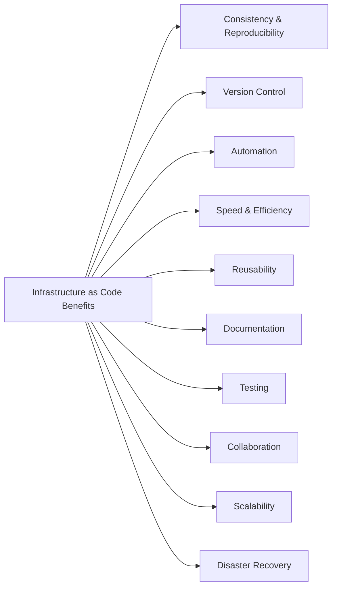
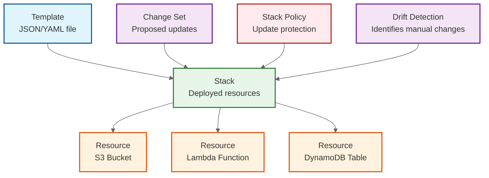
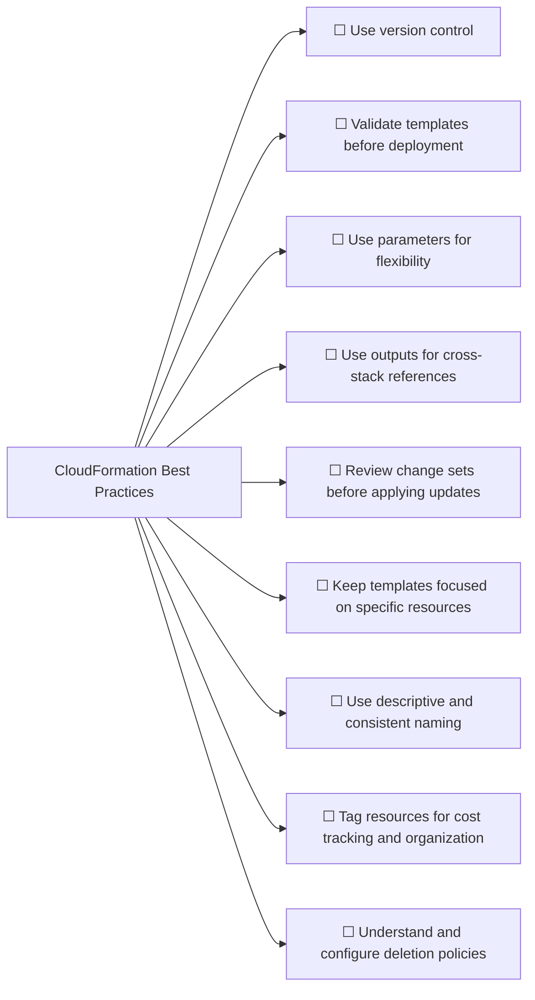
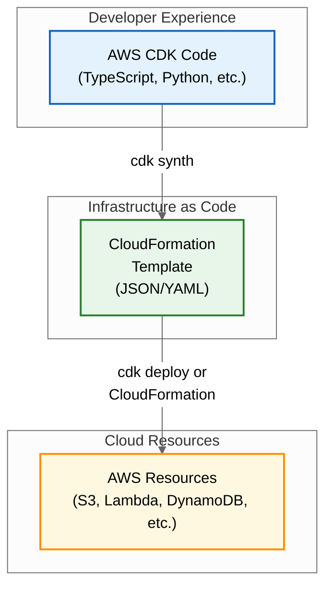

# Chapter 4

## Infrastructure as Code Concepts

*Maya and Ethan settled into a quiet corner of the company's innovation lab. Unlike their previous coffee shop meetings, today they needed access to large display screens to review code side by side. Maya had prepared several examples on her laptop while Ethan unpacked his notebook.*

------

"Last time we created an S3 bucket for MagicMail's assets using the AWS Console," Maya began, pulling up the AWS Management Console on the screen. "We clicked through forms, checked boxes, and entered values into fields."

Ethan nodded. "It was straightforward enough for one bucket. But I imagine doing that for our entire architecture would be tedious."

"More than tedious—it would be error-prone, hard to replicate, and nearly impossible to version control," Maya replied. "That's why today we're going to recreate that same S3 bucket, but using **Infrastructure as Code**."

Maya opened a blank document on her screen. "By the end of today, you'll understand why Infrastructure as Code is transforming how we build cloud systems, and you'll write your first CloudFormation template. This will be a stepping stone before we move on to the more powerful AWS CDK."

## Understanding Infrastructure as Code (IaC)

"Let's start with the fundamentals," Maya said. "What exactly is Infrastructure as Code, or IaC?"

She started typing a definition on the screen:

> *Infrastructure as Code (IaC) is the practice of managing and provisioning computing infrastructure through machine-readable definition files (code!), rather than through physical hardware configuration or interactive configuration tools (like clicking in a console).*

"In simpler terms," she continued, "instead of clicking buttons in a web console, we write code that describes what our infrastructure should look like. Then we use tools to automatically turn that code into actual cloud resources."

"So it's like moving from manual assembly to automated manufacturing," Ethan suggested.

"That's an excellent analogy!" Maya smiled. "Just as automated manufacturing brought consistency, scalability, and quality control to physical production, IaC brings those same benefits to infrastructure deployment."

## Benefits of Infrastructure as Code

Maya pulled up a new slide on the screen with a list of benefits.



*Graphic listing IaC benefits*

"Let's discuss why IaC has become the standard for modern cloud deployments:

> 1. **Consistency & Reproducibility:** When infrastructure is defined as code, you get the same result every time you deploy it. This eliminates configuration drift and the 'it works on my machine' problem for infrastructure.
> 2. **Version Control:** Infrastructure code can be stored in version control systems (like Git) alongside your application code. This gives you a history of changes, allows collaboration, and enables rollbacks.
> 3. **Automation:** Deployments, updates, and teardowns can be fully automated through CI/CD pipelines, reducing manual effort and human error.
> 4. **Speed & Efficiency:** Automated provisioning is much faster than manual configuration, allowing teams to deliver infrastructure and applications more quickly.
> 5. **Reusability:** Code allows you to create reusable templates or modules for common infrastructure patterns, promoting consistency and reducing duplication.
> 6. **Documentation:** The IaC code itself serves as living documentation of your infrastructure configuration.
> 7. **Testing:** Infrastructure code can often be linted, validated, and sometimes even tested before deployment, catching errors early.
> 8. **Collaboration:** Teams can review infrastructure changes using standard code review processes (like pull requests).
> 9. **Scalability:** It's often as easy to deploy 100 identical environments (e.g., for testing or different tenants) as it is to deploy one.
> 10. **Disaster Recovery:** In a disaster scenario, IaC allows you to quickly recreate your entire infrastructure stack in a different region from your code."

"These benefits become crucial as infrastructure complexity grows," Maya added. "For a system like MagicMail with multiple microservices, databases, and APIs, managing it all manually would be unsustainable."

Ethan nodded, jotting notes. "It makes perfect sense. Treat infrastructure like software."

## Declarative vs. Imperative Approaches

Maya drew a simple diagram on the whiteboard, creating two columns.

````mermaid
---
config:
  theme: mc
  themeVariables:
    primaryColor: '#f4f4f4'
    primaryTextColor: '#222'
    primaryBorderColor: '#999'
    lineColor: '#666'
    secondaryColor: '#e9e9e9'
    tertiaryColor: '#f4f4f4'
  look: neo
  layout: dagre
  class:
    hideEmptyMembersBox: true
title: Declarative vs. Imperative IaC Approaches
---
classDiagram
direction TB
    class Declarative {
	    "WHAT you want"
	    ---
	    Characteristics:
	    • Specify desired end state
	    • State-focused
	    • More concise
	    • Simpler reasoning model
	    • Handles complex dependencies
	    • Tool determines steps
	    ---
	    Examples:
	    • AWS CloudFormation
	    • Terraform
	    • Kubernetes manifests
    }
    class Imperative {
	    "HOW to do it"
	    ---
	    Characteristics:
	    • Specify exact commands to run
	    • Process-focused
	    • More explicit control
	    • May require conditional logic
	    • Must handle each possible state
	    • Step-by-step instructions
	    ---
	    Examples:
	    • Shell scripts
	    • AWS CLI commands
	    • Ansible playbooks - partially
    }

```
````

*Diagram contrasting Declarative ('What') vs. Imperative ('How') IaC*

"There are two main approaches to Infrastructure as Code: declarative and imperative," she explained.

"In a **declarative** approach (the 'What'), you define the desired **end state** of your infrastructure—what you want it to look like. The IaC tool is responsible for figuring out *how* to achieve that state. You say, 'I want an S3 bucket with versioning enabled and these specific tags,' and the tool creates it if it doesn't exist, updates it if it differs, or leaves it alone if it already matches.

In an **imperative** approach (the 'How'), you write scripts that specify the exact **sequence of commands** needed to achieve the desired state. You might write code like 'Check if bucket exists; if not, run the command to create the bucket; then run the command to enable versioning; then run the command to add tags.'"

"What's the advantage of one over the other?" Ethan asked.

"Declarative approaches tend to be more robust and easier to manage for infrastructure," Maya replied. "You don't have to explicitly handle all possible starting states or the exact order of operations. You declare the target state, and the tool manages the transitions. This makes the definitions more concise and less prone to errors when dealing with complex dependencies or updates."

"AWS CloudFormation, which we'll start with today, is **declarative**. You describe your desired resources in a template, and CloudFormation manages the lifecycle (create, update, delete) to match that description. AWS CDK, which we'll use later, is also declarative at its core because it generates CloudFormation templates, but it lets you use the power of imperative *programming languages* (like TypeScript) to *generate* those declarative templates."

## Introduction to AWS CloudFormation

Maya opened the AWS CloudFormation console in her browser.


*Screenshot of the CloudFormation console dashboard*

"CloudFormation is AWS's native Infrastructure as Code service. It allows you to model, provision, and manage AWS and third-party resources by treating infrastructure as code. It uses template files written in either **JSON** or **YAML** format to define the resources you want to provision."

She opened a simple YAML file in her editor.

"A CloudFormation template describes your desired resources and their dependencies so you can launch and configure them together as a stack. The most important section is usually the `Resources` section, which defines the AWS resources you want to create (like S3 buckets, EC2 instances, DynamoDB tables, etc.). Each resource has a **Logical ID** (a name you give it within the template), a **Type** (like `AWS::S3::Bucket` or `AWS::EC2::Instance`), and **Properties** that configure that specific resource."

Maya began typing a simple CloudFormation template in YAML:

```yaml
AWSTemplateFormatVersion: '2010-09-09'
Description: 'MagicMail Development Asset Storage (Simple)'

Resources:
  # This is the Logical ID for our S3 Bucket resource
  MagicMailAssetsBucket:
    # This specifies the type of AWS resource to create
    Type: AWS::S3::Bucket
    # These are the specific configurations for the S3 Bucket
    Properties:
      # We'll make the bucket name more robust later
      BucketName: magicmail-assets-dev-cfn-example
      VersioningConfiguration:
        Status: Enabled
      BucketEncryption:
        ServerSideEncryptionConfiguration:
          - ServerSideEncryptionByDefault:
              SSEAlgorithm: AES256
```

"This simple template defines just one resource: an S3 bucket named `magicmail-assets-dev-cfn-example` with versioning enabled and default server-side encryption (SSE-S3). It's similar to the bucket we created manually in the last chapter, but now it's defined in code."

## CloudFormation Concepts

"Before we deploy this, let's understand some key CloudFormation concepts," Maya said, pulling up another diagram.



*Diagram showing relationship: Template -> Deployed as -> Stack (containing Resources), with arrows for Change Sets and Drift Detection*

> - **Template:** The JSON or YAML file containing your infrastructure definition (the code). It describes the resources, their properties, dependencies, parameters, outputs, etc.
> - **Stack:** When you deploy a template, CloudFormation creates a **stack**. A stack is a collection of AWS resources managed as a single unit. You create, update, or delete a stack, and CloudFormation provisions, updates, or deletes the underlying resources accordingly. Think of the template as the blueprint and the stack as the actual building constructed from that blueprint.
> - **Resources:** The individual AWS components defined within your template and provisioned as part of a stack (e.g., an `AWS::S3::Bucket`, an `AWS::Lambda::Function`).
> - **Change Sets:** Before applying updates to an existing stack, you can create a change set. CloudFormation compares your modified template with the currently deployed stack and shows you a preview of exactly what resources will be added, modified, or deleted. This is a crucial safety mechanism to review changes before execution.
> - **Stack Policies:** Optional JSON documents that protect specified stack resources from unintentional updates or deletions during a stack update.
> - **Drift Detection:** CloudFormation can detect if resources within a stack have been modified manually (outside of CloudFormation) since the last stack operation. This difference is called `drift` and helps identify unintended manual changes.

"So a stack is like a live instance of a template?" Ethan asked.

"Exactly. The template is the definition, and the stack is the collection of live AWS resources created based on that definition."

## Creating a Complete CloudFormation Template

"Let's enhance our template to be more flexible and robust, incorporating more features we used previously," Maya said, continuing to edit the YAML file.

```yaml
AWSTemplateFormatVersion: '2010-09-09'
Description: 'MagicMail Development Asset Storage Stack'

# Parameters allow customization at deployment time
Parameters:
  EnvironmentName:
    Description: The environment name (e.g., dev, test, prod)
    Type: String
    Default: dev
    AllowedValues:
      - dev
      - test
      - prod

Resources:
  MagicMailAssetsBucket:
    Type: AWS::S3::Bucket
    Properties:
      # Constructing a globally unique bucket name using parameters and pseudo parameters
      BucketName: !Sub 'magicmail-assets-${EnvironmentName}-${AWS::AccountId}'
      VersioningConfiguration:
        Status: Enabled
      BucketEncryption:
        ServerSideEncryptionConfiguration:
          - ServerSideEncryptionByDefault:
              SSEAlgorithm: AES256
      PublicAccessBlockConfiguration:
        BlockPublicAcls: true
        BlockPublicPolicy: true
        IgnorePublicAcls: true
        RestrictPublicBuckets: true
      # Adding tags for organization and cost tracking
      Tags:
        - Key: Project
          Value: MagicMail
        - Key: Environment
          Value: !Ref EnvironmentName # Reference the parameter value

# Outputs provide information about the created resources
Outputs:
  BucketName:
    Description: Name of the S3 bucket created
    Value: !Ref MagicMailAssetsBucket # Get the physical name of the bucket
    Export:
      Name: !Sub '${AWS::StackName}-AssetsBucketName' # Export for cross-stack reference
  BucketArn:
    Description: ARN of the S3 bucket created
    Value: !GetAtt MagicMailAssetsBucket.Arn # Get the ARN attribute of the bucket
    Export:
      Name: !Sub '${AWS::StackName}-AssetsBucketArn' # Export for cross-stack reference
```

"I've added several important elements," Maya explained.

"First, the `Parameters` section. This allows us to pass in values when we deploy the stack, making the template reusable. Here, we define `EnvironmentName` which defaults to `dev` but can be overridden."

```yaml
Parameters:
  EnvironmentName:
    Description: The environment name (e.g., dev, test, prod)
    Type: String
    Default: dev
    AllowedValues:
      - dev
      - test
      - prod
```

"We use this parameter in the `BucketName` property using the `!Sub` intrinsic function. `!Sub` substitutes variables within a string. We're also using `${AWS::AccountId}`, which is a **pseudo parameter** provided by CloudFormation representing the AWS account ID where the stack is being deployed. **We include the Account ID because S3 bucket names must be globally unique across all AWS accounts**, so this helps ensure our bucket name doesn't collide with one in another account. We also include the `EnvironmentName` to differentiate buckets between environments (dev, test, prod)."

```yaml
      BucketName: !Sub 'magicmail-assets-${EnvironmentName}-${AWS::AccountId}'
```

"We've added the `PublicAccessBlockConfiguration` to match the secure settings from the console, and included `Tags` using the `EnvironmentName` parameter value via the `!Ref` function."

```yaml
      PublicAccessBlockConfiguration:
        BlockPublicAcls: true
        BlockPublicPolicy: true
        IgnorePublicAcls: true
        RestrictPublicBuckets: true
      Tags:
        - Key: Project
          Value: MagicMail
        - Key: Environment
          Value: !Ref EnvironmentName
```

"Finally, the `Outputs` section defines values that CloudFormation will display after the stack is created. These outputs can also be **exported** (using the `Export` field) so they can be referenced by *other* CloudFormation stacks. We're outputting and exporting the bucket's actual name and its ARN, which might be needed by other parts of our MagicMail infrastructure later."

```yaml
Outputs:
  BucketName:
    Description: Name of the S3 bucket created
    Value: !Ref MagicMailAssetsBucket
    Export:
      Name: !Sub '${AWS::StackName}-AssetsBucketName'
  BucketArn:
    Description: ARN of the S3 bucket created
    Value: !GetAtt MagicMailAssetsBucket.Arn
    Export:
      Name: !Sub '${AWS::StackName}-AssetsBucketArn'
```

"I see we're using `!Ref`, `!GetAtt`, and `!Sub`," Ethan noted.

"Good observation," Maya replied. "These are CloudFormation **intrinsic functions** used within templates:

> - `!Ref`: Returns the value of a parameter (like `!Ref EnvironmentName`) or the default identifier of a resource (like `!Ref MagicMailAssetsBucket`, which returns the physical bucket name).
> - `!GetAtt`: Retrieves the value of a specific attribute from a resource (like `!GetAtt MagicMailAssetsBucket.Arn` to get the bucket's ARN). You need to check the CloudFormation documentation for the available attributes for each resource type.
> - `!Sub`: Substitutes variables in a string. Variables are denoted by `${VariableName}`. It can reference parameters, resource logical IDs, resource attributes (using dot notation like `${MagicMailAssetsBucket.Arn}`), and pseudo parameters (like `${AWS::AccountId}`, `${AWS::Region}`, `${AWS::StackName}`).

There are other useful intrinsic functions like `!Join` (to combine strings), `!Split` (to split strings), `!Select` (to pick an element from a list), and conditional functions (`!If`, `!Equals`, `!Not`, etc.) that provide more logic within your templates."

## Deploying a CloudFormation Stack (Console)

"Now let's deploy our template using the AWS console to create the S3 bucket," Maya said, switching to the CloudFormation console.


*Screenshot showing the 'Create stack' button*

"Click `Create stack` (with new resources). Choose `Template is ready` and `Upload a template file`. Select the YAML file we just created."


*Screenshot showing the template file uploaded*

"Click `Next`. Give your stack a name, like `magicmail-assets-dev-stack`. You'll see the `EnvironmentName` parameter with its default value 'dev'. You could override it here if needed."


*Screenshot showing the 'Specify stack details' page with Stack name and Parameters section*

"Click `Next`. On the 'Configure stack options' page, you can add tags *to the stack itself* (separate from resource tags), configure stack policies, rollback behavior, and notification options. We'll leave these as default for now."


*Screenshot showing the 'Configure stack options' page*

"Click `Next`. Review all your choices on the final page. At the bottom, acknowledge that CloudFormation might create IAM resources (though our template doesn't currently) and click `Create stack`."


*Screenshot showing the final review page before creation*

"CloudFormation now starts provisioning the resources defined in the template. You can monitor the progress in the 'Events' tab for the stack."


*Screenshot showing the CloudFormation stack events during creation, ending with CREATE_COMPLETE for the stack*

"Once the status reaches `CREATE_COMPLETE`, navigate to the 'Outputs' tab for the stack. You should see the `BucketName` and `BucketArn` we defined."


*Screenshot showing the 'Outputs' tab with the bucket name and ARN*

"And if we go to the S3 console, we should see our new bucket, named according to the pattern we specified, with versioning enabled and the correct tags."


*Screenshot of the S3 console showing the created bucket and confirming its properties like name, versioning, tags*

## Updating Infrastructure with CloudFormation

"What if we want to modify our infrastructure?" Ethan asked. "Do we have to delete everything and start over?"

"Not at all," Maya replied. "That's a key benefit of IaC. You modify the code (the template) and redeploy. CloudFormation figures out what changed and applies only those changes. Let's add a lifecycle rule to our bucket to transition objects to infrequent access storage after 90 days."

Maya updated the `Properties` section of the `MagicMailAssetsBucket` resource in the template:

```yaml
Resources:
  MagicMailAssetsBucket:
    Type: AWS::S3::Bucket
    Properties:
      # ... (existing properties like BucketName, VersioningConfiguration, etc.) ...
      PublicAccessBlockConfiguration:
        # ... (existing block public access settings) ...
      Tags:
        # ... (existing tags) ...

      # Add Lifecycle Configuration
      LifecycleConfiguration:
        Rules:
          - Id: TransitionToInfrequentAccessRule
            Status: Enabled
            Transitions:
              - StorageClass: STANDARD_IA # Target storage class
                TransitionInDays: 90     # Days after object creation
```

"This `LifecycleConfiguration` block adds a rule to automatically transition objects to the `STANDARD_IA` storage class 90 days after they are created, which can help reduce storage costs for older assets."

"Now let's update our stack. In the CloudFormation console, select the stack (`magicmail-assets-dev-stack`) and click `Update`."


*Screenshot showing the 'Update' button on the stack details page*

"Choose `Replace current template`, upload your modified YAML file, and click `Next` through the parameter and stack options pages (we aren't changing those)."


*Screenshot showing the 'Replace current template' option during stack update

"Before applying the changes, CloudFormation will generate a **Change Set**. Review the changes listed – it should show that the `MagicMailAssetsBucket` resource will be 'Modified' to add the `LifecycleConfiguration`."


*Screenshot showing the Change Set preview, highlighting the modification to the S3 bucket resource*

"This preview step is critical. Always review the change set carefully before executing an update, especially in production. Once you're satisfied, click `Update stack` (or `Execute change set` if you created it separately)."

"CloudFormation will now apply the update."


*Screenshot showing the stack status as UPDATE_IN_PROGRESS*

"Once it reaches `UPDATE_COMPLETE`, you can verify in the S3 console that the bucket now has the lifecycle rule configured under its 'Management' tab."


*Screenshot of the S3 bucket's 'Management' tab showing the configured lifecycle rule*

## Using the AWS CLI for CloudFormation

"We can also manage CloudFormation stacks entirely from the command line using the AWS CLI," Maya explained, opening a terminal window. "This is essential for automation and CI/CD pipelines."

"To create a stack using the CLI, you use the `aws cloudformation deploy` command. This command conveniently packages creating and updating into one action:"

```bash
# Save the template content to a file named magicmail-assets.yaml

aws cloudformation deploy \
  --template-file magicmail-assets.yaml \
  --stack-name magicmail-assets-dev-cli \
  --parameter-overrides EnvironmentName=dev \
  --tags Project=MagicMail Environment=dev \
  --capabilities CAPABILITY_IAM CAPABILITY_NAMED_IAM
```

"Let's break this down:

- `--template-file`: Specifies the path to your template file.
- `--stack-name`: The name for the stack.
- `--parameter-overrides`: Allows you to provide values for parameters defined in the template.
- `--tags`: Allows you to add tags to the stack itself.
- `--capabilities`: Some templates might require explicit acknowledgement of capabilities, such as creating IAM resources (`CAPABILITY_IAM` or `CAPABILITY_NAMED_IAM`) or macros (`CAPABILITY_AUTO_EXPAND`). It's good practice to include these if your template might create such resources, even if our current one doesn't create IAM roles directly.

If the stack doesn't exist, `deploy` creates it. If it *does* exist, `deploy` creates and executes a change set to update it based on the template provided."

"To delete a stack via the CLI:"

```bash
aws cloudformation delete-stack --stack-name magicmail-assets-dev-cli
```

"The CLI approach is powerful for scripting and automating your infrastructure deployments."

## CloudFormation Best Practices

"Before we move on from CloudFormation, let's cover some best practices," Maya said, pulling up another list.




*Graphic summarizing CloudFormation best practices*

> 1. **Use Version Control:** Store your templates in Git or another version control system.
> 2. **Validate Templates:** Use `aws cloudformation validate-template` or linters (like `cfn-lint`) to catch syntax errors before deployment.
> 3. **Use Parameters for Flexibility:** Parameterize environment-specific values (like instance sizes, domain names, environment names) to make templates reusable. Avoid hardcoding values.
> 4. **Use Outputs for Cross-Stack References:** Use outputs and exports (`Export: Name: ...`) to share resource information between stacks. Use `!ImportValue` in other templates to consume exported values.
> 5. **Review Change Sets:** Always create and review change sets before updating stacks to understand the impact of your changes.
> 6. **Keep Templates Focused:** Break down large, complex infrastructure into smaller, more manageable stacks focused on specific components or lifecycles.
> 7. **Use Descriptive Naming:** Use clear logical IDs for resources and meaningful descriptions in parameters, resources, and outputs.
> 8. **Tag Resources:** Use tags consistently for cost allocation, automation, and organization.
> 9. **Understand Deletion Policies:** Use `DeletionPolicy: Retain` on critical stateful resources (like databases or S3 buckets with important data) to prevent accidental data loss when a stack is deleted. The default is often `Delete` (except for some resources like non-empty S3 buckets).

## From CloudFormation to AWS CDK

"CloudFormation is powerful and fundamental to AWS IaC, but writing and maintaining large JSON or YAML templates can become complex and verbose," Maya said. "Managing logic, loops, or creating truly reusable components can be challenging."



*Diagram showing CDK code -> (Synth) -> CloudFormation Template -> (Deploy) -> AWS Resources*

"That's where the **AWS Cloud Development Kit (CDK)** comes in. CDK lets you define your infrastructure using familiar programming languages like TypeScript, Python, Java, C#, or Go. Your CDK code *generates* CloudFormation templates behind the scenes, but you get the full power of a real programming language."

"This means you can:

>- Use variables, loops, conditionals, functions, classes, and inheritance.
>- Create strongly-typed, reusable infrastructure components (called Constructs).
>- Benefit from IDE features like autocompletion and inline documentation.
>- Write unit tests for your infrastructure code.
>- Often write significantly less code compared to raw CloudFormation for the same result, thanks to higher-level abstractions provided by CDK."

"In our next session, we'll dive into TypeScript fundamentals, which will prepare us to use CDK effectively for building MagicMail's infrastructure in a much more expressive way."

## Cleaning Up and Next Steps

"Let's clean up the resources we created today to avoid any unnecessary charges," Maya said, navigating back to the CloudFormation console.


*Screenshot showing the 'Delete' button for a selected stack*

"Select the stack we created (`magicmail-assets-dev-stack` or `magicmail-assets-dev-cli`) and click `Delete`. Confirm the deletion."


*Screenshot showing the stack status as DELETE_IN_PROGRESS*

"CloudFormation will now delete the resources managed by the stack, including the S3 bucket (since we didn't set a `DeletionPolicy: Retain`)."

"For homework, I'd like you to browse the CloudFormation documentation for a few other resource types we'll likely use later, like `AWS::Lambda::Function` and `AWS::DynamoDB::Table`. Just look at their properties to get a feel for how different resources are defined in CloudFormation templates. Don't worry about understanding every detail yet."

Ethan nodded, closing his notebook. "I'm starting to see the power of defining infrastructure in code. CloudFormation seems capable, but I can already imagine how using a real programming language with CDK will make things even better."

"Exactly," Maya smiled. "CloudFormation is the engine, and CDK provides a more developer-friendly way to interact with it. Mastering IaC is a key skill for cloud development, and you're well on your way."

## Ethan's Homework

> 1. Review the CloudFormation template created in this chapter. Identify the `Parameters`, `Resources`, and `Outputs` sections.
> 2. Look up the CloudFormation documentation for `AWS::Lambda::Function`. What are some key properties required to define a Lambda function? (e.g., Handler, Role, Code, Runtime).
> 3. Look up the CloudFormation documentation for `AWS::DynamoDB::Table`. What properties are needed to define the primary key? (e.g., KeySchema, AttributeDefinitions).
> 4. (Optional) Try deploying the final template from this chapter using the AWS CLI `aws cloudformation deploy` command, then delete it using `aws cloudformation delete-stack`.

## Key Takeaways

> - Infrastructure as Code (IaC) manages infrastructure through code, offering consistency, automation, version control, and scalability.
> - AWS CloudFormation is AWS's native declarative IaC service using JSON or YAML **Templates**.
> - Templates define **Resources**, **Parameters**, and **Outputs**. Deployed templates create **Stacks**.
> - **Change Sets** provide crucial previews before updating stacks.
> - CloudFormation **intrinsic functions** (`!Ref`, `!GetAtt`, `!Sub`, etc.) add logic to templates.
> - Stacks can be managed via the AWS Console or the AWS CLI (`deploy`, `delete-stack`).
> - Following best practices (version control, validation, parameters, outputs, change sets, focused stacks, `DeletionPolicy`) is vital.
> - AWS CDK builds upon CloudFormation, allowing infrastructure definition in programming languages for greater expressiveness and reusability.

## Looking Ahead

In the next chapter, Maya will introduce Ethan to TypeScript fundamentals, covering the essential programming concepts needed to effectively use the AWS CDK for building MagicMail's infrastructure.

## AWS Services Introduced

- No new services (focused on CloudFormation concepts).
