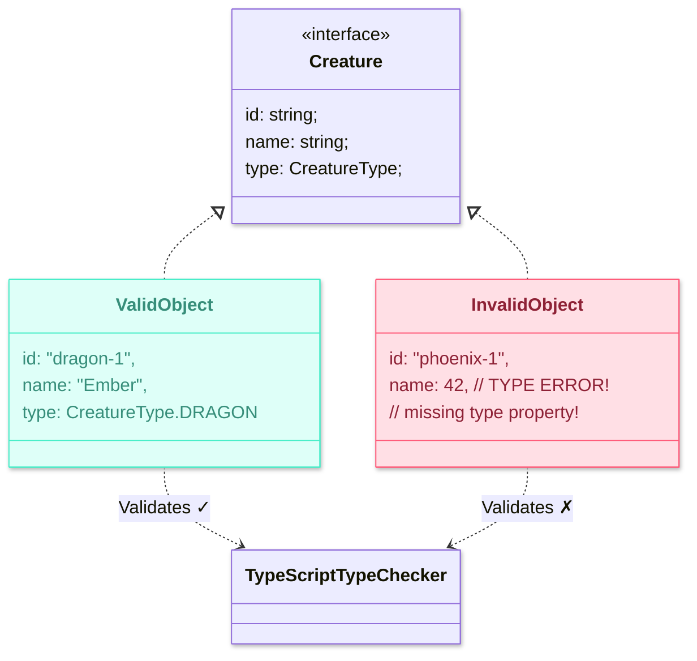
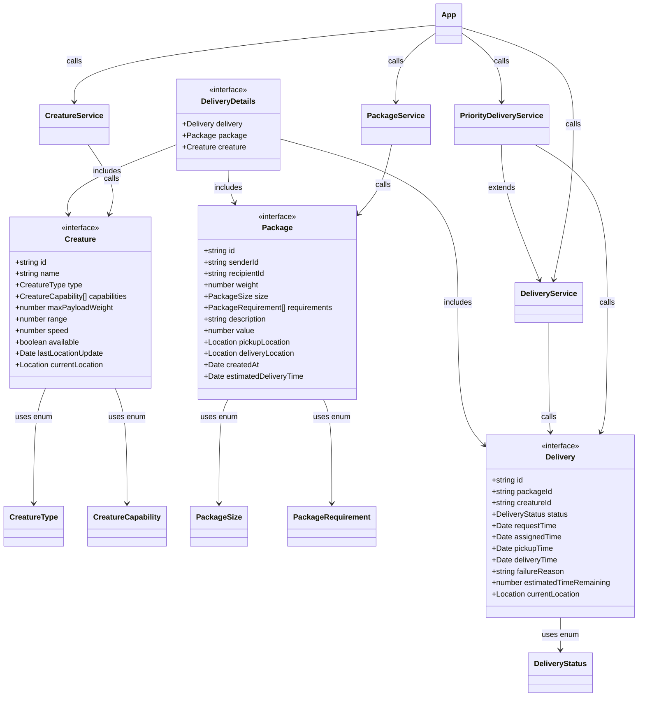
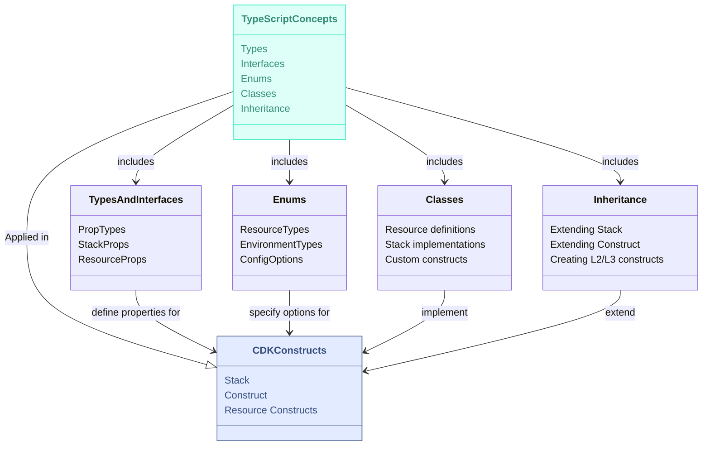

# Chapter 5

## TypeScript Fundamentals

*Maya had booked a small conference room for their fifth session. When Ethan arrived, he found her setting up her laptop and connecting it to the large display. The room's whiteboard was already covered with TypeScript syntax examples.*

------

"Today's session is going to be a bit different," Maya said as Ethan took a seat. "Before we dive deeper into CDK, we need to get comfortable with TypeScript. It's the language we'll use to define our infrastructure."

Ethan opened his laptop. "I'm familiar with JavaScript, but I've never used TypeScript before. Is it very different?"

"TypeScript is a **superset** of JavaScript," Maya explained, pointing to a simple diagram on the whiteboard. "That means all valid JavaScript code is also valid TypeScript code. However, TypeScript adds features on top of JavaScript, most importantly **static typing**, along with other enhancements like **interfaces**, **enums**, and better support for object-oriented programming. These features are used during development to improve code quality and catch errors early, but when compiled, they are **transformed into standard JavaScript**, ensuring compatibility with any JavaScript runtime."


*Diagram showing TypeScript as a superset of JavaScript, and compiles to JavaScript*

"So we're learning TypeScript specifically to use with CDK?" Ethan asked.

"Exactly. AWS CDK was designed with TypeScript as its primary language, though it supports others too. TypeScript's static typing helps us catch errors during development and compilation, *before* we deploy our infrastructure, which can save a lot of time and prevent mistakes. It also enables better tooling, like autocompletion and refactoring in our code editor," Maya explained. "Furthermore, CDK uses TypeScript's object-oriented features (like classes and interfaces) extensively to create its component model for infrastructure. Understanding these concepts is essential for working effectively with CDK constructs in the next chapter."

## Setting Up a TypeScript Project

"Let's start by setting up a basic TypeScript project," Maya suggested. "We won't build infrastructure yet, but we'll use this project to practice TypeScript concepts by modeling some core parts of our MagicMail domain."

"Think of these models as digital blueprints for the key entities in our system," she continued. "Just like an architect creates models before building a house, we'll create code models for things like magical creatures, packages, and deliveries. This helps clarify our understanding of the business requirements and gives us practical examples for learning TypeScript."

She opened a terminal window. "First, let's create a new directory for this exercise and initialize a Node.js project using npm (Node Package Manager)."

```bash
mkdir magicmail-ts-model
cd magicmail-ts-model
npm init -y
```


*Screenshot showing the creation of package.json*

"The `npm init -y` command creates a basic `package.json` file. This file tracks project details, dependencies (libraries our code uses), and scripts (commands to build or run our project)," Maya explained. "Now, let's install TypeScript itself as a development dependency."

```bash
npm install typescript --save-dev
# or using shorthand: npm i -D typescript
```

"The `--save-dev` (or `-D`) flag tells npm that TypeScript is only needed for development, not for running the final compiled JavaScript code. Next, we'll initialize the TypeScript configuration:"

```bash
npx tsc --init
```


*Screenshot showing the creation of tsconfig.json*

"This command creates a `tsconfig.json` file, which contains settings that control how the TypeScript compiler (`tsc`) behaves," Maya said, opening the newly created file. "Let's modify a few key settings for our project."

Maya edited the `tsconfig.json` file:

```json
{
  "compilerOptions": {
    /* Visit https://aka.ms/tsconfig to read more about this file */

    /* Language and Environment */
    "target": "ES2018", // Compile to modern JavaScript version supported by Node.js
    "lib": ["ES2018", "DOM"], // Include standard libraries for modern JS and DOM APIs

    /* Modules */
    "module": "commonjs", // Use the module system standard in Node.js
    // "rootDir": "./src", // Specify the root directory of input files

    /* Emit */
    "declaration": true, // Generate corresponding '.d.ts' declaration files
    "outDir": "./dist", // Redirect output structure to the directory
    // "sourceMap": true, // Generate source map files for debugging

    /* Interop Constraints */
    "esModuleInterop": true, // Enables compatibility with CommonJS modules
    "forceConsistentCasingInFileNames": true, // Disallow inconsistently-cased references to the same file.

    /* Type Checking */
    "strict": true, // Enable all strict type-checking options (highly recommended)
    // "noImplicitAny": true, // Raise error on expressions and declarations with an implied 'any' type.

    /* Completeness */
    "skipLibCheck": true // Skip type checking of declaration files
  },
  "include": ["src/**/*"], // Specify which files TypeScript should compile
  "exclude": ["node_modules", "**/*.test.ts"] // Specify files/directories to exclude
}
```

"Let me explain some key settings," Maya said:

- `"target": "ES2018"`: Specifies the JavaScript version our TypeScript code will be compiled *down* to. ES2018 is well-supported in modern Node.js environments, which CDK uses.
- `"module": "commonjs"`: Defines the module system to use for the compiled JavaScript (Node.js uses CommonJS).
- `"strict": true`: Enables a suite of strict type-checking options. This is highly recommended as it helps catch many potential errors during development.
- `"esModuleInterop": true`: Improves compatibility between different types of JavaScript modules.
- `"outDir": "./dist"`: Tells the compiler to put the output JavaScript files into a directory named `dist`.
- `"declaration": true`: Tells the compiler to also generate corresponding `.d.ts` files, which describe the types in our compiled code (useful for libraries).
- `"include": ["src/**/*"]`: Specifies that TypeScript should compile all files within the `src` directory.
- `"exclude": [...]`: Specifies files or directories to ignore during compilation.

"Now, let's create our source directory structure. We'll organize our code into logical folders, a practice we'll also follow in our CDK projects."

```bash
mkdir src
# Optional subdirectories for organization:
# mkdir -p src/models src/services src/utils
```

"Perfect. Now we're ready to write our first TypeScript code."

## First TypeScript Program: Hello World

"Let's start with the simplest possible TypeScript program to see the core concept in action," Maya suggested, creating a new file called `src/hello.ts`.

```typescript
// src/hello.ts

// A simple function demonstrating type annotations for parameters and return value
function greet(name: string): string {
  return `Hello, ${name}!`;
}

// Declaring a variable with a type annotation
const userName: string = "Magical World";
console.log(greet(userName));

// Let's see what happens if we try to misuse the function:
// Uncomment the line below to see the TypeScript error during compilation
// console.log(greet(42));
```

"This simple program highlights the key feature of TypeScript: **type annotations**," Maya explained. "Notice `: string` after the `name` parameter and after the function definition? These annotations explicitly tell TypeScript (and other developers, and our editor) what type of data is expected or returned."

"How does this actually run?" Ethan asked.

"Good question. TypeScript code doesn't run directly in Node.js or browsers. It needs to be **compiled** into standard JavaScript first. Let's do that."

```bash
# Compile the TypeScript file into JavaScript
npx tsc src/hello.ts

# Run the compiled JavaScript file using Node.js
node src/hello.js
```


*Screenshot showing the compilation command and the 'Hello, Magical World!' output from the node command*

"The first command, `npx tsc src/hello.ts`, invokes the TypeScript compiler (`tsc`) on our file. By default, it creates a corresponding `.js` file (`src/hello.js`) in the same directory (though our `tsconfig.json` would put it in `dist` if we compiled the whole project). The second command, `node src/hello.js`, runs the generated JavaScript file."

"Let's look at the generated `hello.js`:"

```javascript
// src/hello.js (Compiled from hello.ts)

// A simple function demonstrating type annotations for parameters and return value
function greet(name) {
    return "Hello, ".concat(name, "!");
}
// Declaring a variable with a type annotation
var userName = "Magical World";
console.log(greet(userName));
// Let's see what happens if we try to misuse the function:
// Uncomment the line below to see the TypeScript error during compilation
// console.log(greet(42));
```

"Notice how all the type annotations (`: string`) are gone?" Maya pointed out. "TypeScript's type system exists only during **development and compilation**. It helps us write safer, more maintainable code, but the final output is plain JavaScript that can run anywhere."

"Now, try uncommenting the last line in `src/hello.ts` (`console.log(greet(42));`) and run the compilation command `npx tsc src/hello.ts` again."


*Screenshot showing the TypeScript error: "Argument of type 'number' is not assignable to parameter of type 'string'.*

"See that error?" Maya asked. "TypeScript analyzed the code and detected that we're trying to pass a `number` (42) to a function that explicitly expects a `string`. It stops the compilation and tells us about the mistake. This immediate feedback is incredibly valuable, especially in large projects like our CDK infrastructure where such type mismatches could lead to deployment failures or runtime errors."

"This type-checking capability is why we use TypeScript with CDK. CDK provides many predefined types for AWS resources and their configurations. TypeScript helps ensure we use them correctly, catching errors early in the development cycle."

## TypeScript Basics: Types, Interfaces, and Enums

"Now that we understand the basic workflow, let's model our MagicMail domain using more TypeScript features," Maya said. "We'll start by defining the structure of our data using interfaces and enums."

"This approach focuses on defining the 'shape' of our data first," Maya explained. "We'll use `enum` for fixed sets of values and `interface` to describe the structure of our objects like creatures and packages."

Maya created a new file at `src/models/creature.ts`. *`(If you didn't create subdirectories earlier, create src/model now)`*.

"In MagicMail, magical creatures deliver packages. Let's create a TypeScript model for them."

```typescript
// src/models/creature.ts

// Using an enum for a fixed set of creature types.
// Provides type safety and autocompletion compared to using raw strings.
export enum CreatureType {
  DRAGON = 'dragon',
  PHOENIX = 'phoenix',
  GRIFFIN = 'griffin',
  UNICORN = 'unicorn',
  PEGASUS = 'pegasus',
}

// Using an enum for creature capabilities.
export enum CreatureCapability {
  FLYING = 'flying',
  FIREPROOF = 'fireproof',
  WATERPROOF = 'waterproof',
  COLDRESISTANT = 'cold-resistant',
  HEAVYLIFTING = 'heavy-lifting',
  SPEEDYDELIVERY = 'speedy-delivery',
}

// Using an interface to define the "shape" or "contract" for a Creature object.
// It specifies the required and optional properties and their types.
export interface Creature {
  id: string; // Required property of type string
  name: string;
  type: CreatureType; // Using the enum type
  capabilities: CreatureCapability[]; // An array where each element must be of CreatureCapability type
  maxPayloadWeight: number; // in kilograms
  range: number; // in kilometers
  speed: number; // in km/h
  available: boolean;
  lastLocationUpdate?: Date; // Optional property (denoted by '?') of type Date
  currentLocation?: { // Optional property that is an object itself
    latitude: number;
    longitude: number;
  };
}
```

"Let's break this down," Maya said, drawing on the whiteboard.



*Diagram illustrating how enums define constants, interfaces define object shapes, and the TS compiler checks objects against interfaces*

"First, we defined two `enum` types: `CreatureType` and `CreatureCapability`. An **enum** (enumeration) in TypeScript is a way to define a set of named constants. It's perfect for representing fixed sets of values, like the types of creatures we support or their possible abilities. Using enums (`CreatureType.DRAGON`) instead of raw strings (`'dragon'`) provides several benefits:

- **Type Safety:** Prevents typos (e.g., `'grifin'` instead of `'griffin'`). TypeScript will error if you try to assign an invalid value.
- **Readability:** Makes the code clearer about the intended values.
- **Refactoring:** Easier to rename or change values later.
- **Autocompletion:** Code editors can suggest valid enum members.

```typescript
// Example Enum:
export enum CreatureType {
  DRAGON = 'dragon',
  PHOENIX = 'phoenix',
  // ...
}
```

"Next, we defined the `Creature` **interface**. An interface in TypeScript acts like a contract or a blueprint for objects. It describes the expected 'shape' of an object—what properties it must have, what properties are optional, and what the types of those properties should be."

```typescript
// Example Interface:
export interface Creature {
  id: string; // Required string property
  name: string;
  type: CreatureType; // Property using an enum type
  capabilities: CreatureCapability[]; // Property that's an array of enum types
  available: boolean;
  lastLocationUpdate?: Date; // Optional Date property (indicated by '?')
  // ...
}
```

"Key points about the interface:

- It defines the structure, but doesn't create objects itself.
- Properties are required by default. Adding a `?` after the property name (like `lastLocationUpdate?`) makes it **optional**.
- We can use primitive types (`string`, `number`, `boolean`), complex types (`Date`, other interfaces/objects), enum types (`CreatureType`), and arrays (`CreatureCapability[]`).
- We used the `export` keyword. This makes the enums and interface available for use in other files via the `import` statement, enabling modular code."

Ethan studied the code. "So the interface tells TypeScript what a valid `Creature` object should look like, and the enums define the allowed values for certain properties?"

"Exactly," Maya replied. "And TypeScript checks our code against these definitions:

> 1. **During Development:** Your code editor (like VS Code) uses this information to provide autocompletion and highlight errors as you type.
> 2. **During Compilation:** The `tsc` compiler rigorously verifies that all objects we create or use match their declared types or interfaces.

This helps catch errors *before* the code even runs."

"When we work with CDK, we'll use interfaces provided by the CDK library (e.g., `s3.BucketProps`) to configure AWS resources. TypeScript will ensure we provide the correct properties with the correct types."

"Now let's model packages," Maya continued, creating `src/models/package.ts`.

```typescript
// src/models/package.ts

export enum PackageSize {
  SMALL = 'small',
  MEDIUM = 'medium',
  LARGE = 'large',
  EXTRA_LARGE = 'extra-large',
}

export enum PackageRequirement {
  FRAGILE = 'fragile',
  REFRIGERATED = 'refrigerated', // Renamed from TEMPERATURE_CONTROLLED for clarity
  FIREPROOF = 'fireproof',
  WATERPROOF = 'waterproof',
  URGENT = 'urgent',
}

export interface Package {
  id: string;
  senderId: string;
  recipientId: string;
  weight: number; // in kilograms
  size: PackageSize;
  requirements: PackageRequirement[];
  description: string;
  value?: number; // Made optional, maybe not all packages have declared value
  pickupLocation: {
    latitude: number;
    longitude: number;
    address: string;
  };
  deliveryLocation: {
    latitude: number;
    longitude: number;
    address: string;
  };
  createdAt: Date;
  estimatedDeliveryTime?: Date;
}
```

"And finally, deliveries," Maya said, creating `src/models/delivery.ts`.

```typescript
// src/models/delivery.ts
import { Creature } from './creature'; // Assuming models are in separate files
import { Package } from './package';   // Use './creature' if in the same directory

export enum DeliveryStatus {
  REQUESTED = 'requested',
  ASSIGNED = 'assigned',
  PICKED_UP = 'picked-up',
  IN_TRANSIT = 'in-transit',
  DELIVERED = 'delivered',
  FAILED = 'failed',
  CANCELLED = 'cancelled',
}

// Basic delivery info, referencing other entities by ID
export interface Delivery {
  id: string;
  packageId: string; // Reference to Package ID
  creatureId?: string; // Optional: Might not be assigned immediately
  status: DeliveryStatus;
  requestTime: Date;
  assignedTime?: Date;
  pickupTime?: Date;
  deliveryTime?: Date;
  failureReason?: string;
  estimatedTimeRemaining?: number; // in minutes
  currentLocation?: {
    latitude: number;
    longitude: number;
  };
}

// A more comprehensive type combining full objects for detailed views
// This demonstrates composing interfaces
export interface DeliveryDetails {
  deliveryInfo: Delivery;
  packageInfo: Package;
  creatureInfo?: Creature; // Creature might be optional if not assigned yet
}
```

"This file introduces a few more concepts," Maya explained. "First, the `import` statement allows us to use types (like `Creature` and `Package`) defined in other files. This is fundamental to building modular applications."

"Second, we're showing two ways to model related data. The `Delivery` interface uses IDs (`packageId`, `creatureId`) to reference other entities. The `DeliveryDetails` interface, however, embeds the full `Package` and `Creature` objects, which might be useful when displaying complete delivery information. This pattern of referencing by ID versus embedding full objects is common in system design, and we'll see similar choices when defining relationships between AWS resources in CDK."

## Working with Types: Creating Objects and Functions

"Now that we've defined our models, let's write some code that uses them," Maya said, creating `src/examples.ts`.

```typescript
// src/examples.ts
import { Creature, CreatureType, CreatureCapability } from './models/creature';
// Adjust import paths if models are not in a subdirectory:
// import { Creature, CreatureType, CreatureCapability } from './creature';

// Create an array explicitly typed to hold only Creature objects
const creatures: Creature[] = [
  {
    id: 'dragon-001',
    name: 'Ember',
    type: CreatureType.DRAGON,
    capabilities: [
      CreatureCapability.FLYING,
      CreatureCapability.FIREPROOF,
      CreatureCapability.HEAVYLIFTING,
    ],
    maxPayloadWeight: 500,
    range: 1000,
    speed: 80,
    available: true,
    // currentLocation and lastLocationUpdate are optional, so omitted here
  },
  {
    id: 'phoenix-001',
    name: 'Blaze',
    type: CreatureType.PHOENIX,
    capabilities: [
      CreatureCapability.FLYING,
      CreatureCapability.FIREPROOF,
      CreatureCapability.SPEEDYDELIVERY,
    ],
    maxPayloadWeight: 50,
    range: 800,
    speed: 120,
    available: true,
    lastLocationUpdate: new Date(), // Optional properties can be included
    currentLocation: {
      latitude: 37.7749,
      longitude: -122.4194,
    },
  },
  // Add more creatures if desired...
];

// Function typed to accept a string ID and return a Creature or undefined
function findCreatureById(id: string): Creature | undefined {
  // The 'find' method itself returns T | undefined, matching our return type
  return creatures.find(creature => creature.id === id);
}

// Function typed to accept a capability and return an array of Creatures
function findAvailableCreaturesByCapability(capability: CreatureCapability): Creature[] {
  // Filter returns an array, matching our return type
  return creatures.filter(
    creature => creature.available && creature.capabilities.includes(capability)
  );
}

// --- Using our typed functions ---

console.log("--- Available Flying Creatures ---");
const flyingCreatures = findAvailableCreaturesByCapability(CreatureCapability.FLYING);

if (flyingCreatures.length > 0) {
  flyingCreatures.forEach(creature => {
    // TypeScript knows 'creature' is of type Creature here,
    // so editor provides autocompletion for creature.name, creature.type etc.
    console.log(`- ${creature.name} (${creature.type}): Speed ${creature.speed} km/h`);
  });
} else {
  console.log("No available flying creatures found.");
}


console.log("\n--- Finding a Specific Creature ---");
const specificCreatureId = 'dragon-001';
const foundCreature = findCreatureById(specificCreatureId);

// We must check if foundCreature is defined because the return type is Creature | undefined
if (foundCreature) {
  console.log(`Found creature: ${foundCreature.name}`);
  console.log(`Type: ${foundCreature.type}`);
  // TypeScript knows foundCreature is a Creature here, so accessing properties is safe
  console.log(`Capabilities: ${foundCreature.capabilities.join(', ')}`);
  console.log(`Is Available: ${foundCreature.available}`);
} else {
  console.log(`Creature with ID ${specificCreatureId} not found!`);
}

// --- Example of TypeScript catching errors ---
// Uncomment the block below and try compiling to see the errors

/*
const badCreatureAttempt: Creature = {
  // Missing required properties: id, name, type, capabilities, etc.
  // TypeScript Error: Type '{}' is missing the following properties from type 'Creature':
  // id, name, type, capabilities, and 5 more.ts(2740)
  speed: 50,
  available: false
};

const anotherBadAttempt = {
  id: 'unicorn-001',
  name: 'Sparkle',
  type: 'Unicorn', // Type '"Unicorn"' is not assignable to type 'CreatureType'.ts(2322)
  capabilities: [CreatureCapability.FLYING, 'Healing'], // Type 'string' is not assignable to type 'CreatureCapability'.ts(2322)
  maxPayloadWeight: 100,
  range: 500,
  speed: 70,
  available: true,
  wingspan: 3 // Property 'wingspan' does not exist on type 'Creature'.ts(2339)
};

// Assigning the structurally incorrect object to a Creature type variable
const badAssignment: Creature = anotherBadAttempt; // Causes multiple errors
*/
```

"Now, let's compile and run this. But first, a learning moment about TypeScript compilation," Maya said deliberately. "What happens if we try to compile *only* this single file, ignoring our project's `tsconfig.json`?"

```typescript
# Attempting to compile only examples.ts (might fail depending on TS/Node defaults)
npx tsc src/examples.ts
```


*Screenshot showing potential errors like "Cannot find name 'find'." or issues with array methods if default libs aren't included*

"You *might* see errors here," Maya explained. "Depending on the exact defaults TypeScript uses when run without a config file, it might not recognize things like `console.log` or modern array methods like `.find()` or `.includes()`. This demonstrates why relying on the project's `tsconfig.json` is important – it ensures the compiler knows which JavaScript features and libraries (like `ES2018`, `DOM`) are available in our target environment."

"The **correct** way to compile our code is to compile the *entire project* based on the `tsconfig.json` settings. This ensures all files are checked consistently and use the specified language features and libraries."

```bash
# Compile the entire project using tsconfig.json
npx tsc
```

"This command reads `tsconfig.json`, finds all files specified in the `include` section (our `src` directory), checks them, and outputs the compiled JavaScript into the `outDir` (`./dist`). Now, let's run the compiled example code:"

```bash
# Run the compiled JavaScript output from the 'dist' directory
node dist/examples.js
```


*Screenshot showing the correct output: list of flying creatures and details of the found dragon*

"This workflow – compiling the whole project with `npx tsc` and running the output from `dist` – is exactly how we'll work with our CDK applications. The CDK toolkit actually handles the `tsc` compilation step automatically when you run commands like `cdk synth` or `cdk deploy`, but understanding the underlying process is crucial."

"Let's review the key TypeScript concepts in `examples.ts`," Maya pointed out:

> - **Typed Arrays:** `const creatures: Creature[]` explicitly declares an array that can *only* hold objects matching the `Creature` interface.
> - **Typed Functions:** Functions like `findCreatureById` have type annotations for parameters (`id: string`) and return values (`Creature | undefined`). The `|` creates a **union type**, meaning the function can return either a `Creature` or `undefined`.
> - **Type Inference:** Inside the `.forEach` loop for `flyingCreatures`, TypeScript infers that the `creature` variable is of type `Creature` because `flyingCreatures` is known to be `Creature[]`. This enables autocompletion and type checking within the loop.
> - **Type Guards:** The `if (foundCreature)` check acts as a **type guard**. Inside the `if` block, TypeScript knows `foundCreature` cannot be `undefined` and treats it as type `Creature`, allowing safe access to its properties.
> - **Compile-Time Errors:** The commented-out `badCreatureAttempt` and `anotherBadAttempt` examples show how TypeScript catches various errors: missing required properties, assigning incorrect types (string instead of enum), using invalid enum values, or adding properties not defined in the interface.

"When we work with CDK, we'll constantly be creating objects that need to conform to specific interfaces (like `s3.BucketProps`) and calling functions or methods with specific type requirements. TypeScript will be our safety net."

## Introduction to Classes

"What we've done so far—defining data structures with interfaces/enums and creating separate functions to operate on that data—is often associated with a more functional programming style," Maya explained. "It keeps data and behavior separate."

"Now let's look at an **object-oriented** approach using **classes**. A class defines a blueprint for creating objects that group together related **data** (called *properties*) and **functions** that operate on that data (called *methods*). This approach is widely used in modern programming because it helps organize code into modular, reusable building blocks — a concept you'll see in action very soon when we start working with CDK."

Maya created a new file at `src/services/creature-service.ts` *`(or src/creature-service.ts)`*.

```typescript
// src/services/creature-service.ts
import { Creature, CreatureType, CreatureCapability } from '../models/creature';
// Adjust import path if needed: import { Creature, ... } from '../creature';

// A class encapsulates data (creatures) and behavior (methods) related to creatures.
export class CreatureService {
  // 'private' properties are only accessible from within this class instance.
  // This enforces encapsulation - hiding internal implementation details.
  private creatures: Creature[] = [];

  // The 'constructor' is a special method called when a new instance
  // of the class is created (e.g., using 'new CreatureService()').
  // It's typically used to initialize the object's state.
  // Here, it accepts an optional array of initial creatures.
  constructor(initialCreatures: Creature[] = []) {
    // 'this' refers to the instance of the class being created.
    this.creatures = initialCreatures;
  }

  // Methods define the behavior of the class. They operate on the instance's data.
  // This method returns all creatures stored in this service instance.
  getAllCreatures(): Creature[] {
    return this.creatures;
  }

  // Find a creature by its ID within this service instance's list.
  getCreatureById(id: string): Creature | undefined {
    return this.creatures.find(creature => creature.id === id);
  }

  // Add a new creature to this service instance's list.
  // 'void' indicates this method doesn't return a value.
  addCreature(creature: Creature): void {
    // Check if creature with this ID already exists (optional, good practice)
    if (!this.getCreatureById(creature.id)) {
      this.creatures.push(creature);
    } else {
      console.warn(`Creature with ID ${creature.id} already exists.`);
    }
  }

  // Find available creatures by capability from this instance's list.
  getAvailableCreaturesByCapability(capability: CreatureCapability): Creature[] {
    return this.creatures.filter(
      creature => creature.available && creature.capabilities.includes(capability)
    );
  }

  // Update the availability status of a specific creature in this instance's list.
  updateCreatureAvailability(id: string, available: boolean): boolean {
    const creature = this.getCreatureById(id);
    if (creature) {
      creature.available = available;
      return true; // Indicate success
    }
    return false; // Indicate creature not found
  }
}
```

"A **class** in TypeScript is a blueprint for creating objects," Maya explained. "It combines:

- **Properties (Data/State):** Variables that hold the object's data (e.g., `private creatures: Creature[]`). The `private` keyword restricts access to this property from outside the class, promoting **encapsulation**.
- **Constructor (Initialization):** A special method (`constructor`) that runs when you create a new object (instance) from the class using the `new` keyword. It initializes the object's properties.
- **Methods (Behavior):** Functions defined within the class that operate on the object's properties (e.g., `getAllCreatures()`, `addCreature()`). Methods use the `this` keyword to access the instance's properties and other methods."

"To use this class, we'd create an **instance** of it in another file:"

```typescript
// --- Example Usage (in a different file like app.ts) ---
// Import the class and required types
import { CreatureService } from './services/creature-service';
import { Creature, CreatureType, CreatureCapability } from './models/creature';

// Sample initial data
const initialCreatures: Creature[] = [
  { id: 'dragon-001', name: 'Ember', type: CreatureType.DRAGON, capabilities: [CreatureCapability.FLYING], maxPayloadWeight: 500, range: 1000, speed: 80, available: true }
];

// Create an instance of CreatureService using the 'new' keyword
const creatureServiceInstance = new CreatureService(initialCreatures);

// Call methods on the instance
const allCreatures = creatureServiceInstance.getAllCreatures();
console.log(`Total creatures: ${allCreatures.length}`); // Output: 1

// Add a new creature via the instance method
creatureServiceInstance.addCreature({
  id: 'griffin-001', name: 'Swiftclaw', type: CreatureType.GRIFFIN, capabilities: [CreatureCapability.FLYING, CreatureCapability.HEAVYLIFTING], maxPayloadWeight: 300, range: 800, speed: 95, available: true
});

const updatedCreatures = creatureServiceInstance.getAllCreatures();
console.log(`Total creatures now: ${updatedCreatures.length}`); // Output: 2

const swiftclaw = creatureServiceInstance.getCreatureById('griffin-001');
if (swiftclaw) {
    console.log(`Found: ${swiftclaw.name}`);
}
```

"This class-based approach is fundamental to CDK," Maya emphasized. "CDK provides base classes (like `cdk.Stack`, `s3.Bucket`, `lambda.Function`). We create our infrastructure by instantiating these classes (`new s3.Bucket(...)`) or by creating our *own* classes that **extend** these base classes to add custom logic or group resources."

"Let's quickly create a similar service class for packages," Maya said, creating `src/services/package-service.ts`.

```typescript
// src/services/package-service.ts
import { Package, PackageSize, PackageRequirement } from '../models/package';
// Adjust import path if needed

export class PackageService {
  private packages: Package[] = [];

  constructor(initialPackages: Package[] = []) {
    this.packages = initialPackages;
  }

  getAllPackages(): Package[] {
    return this.packages;
  }

  getPackageById(id: string): Package | undefined {
    return this.packages.find(pkg => pkg.id === id);
  }

  addPackage(pkg: Package): void {
    if (!this.getPackageById(pkg.id)) {
        this.packages.push(pkg);
    } else {
        console.warn(`Package with ID ${pkg.id} already exists.`);
    }
  }

  getPackagesByRequirement(requirement: PackageRequirement): Package[] {
    return this.packages.filter(pkg => pkg.requirements.includes(requirement));
  }

  updateEstimatedDeliveryTime(id: string, estimatedDeliveryTime: Date): boolean {
    const pkg = this.getPackageById(id);
    if (pkg) {
      pkg.estimatedDeliveryTime = estimatedDeliveryTime;
      return true;
    }
    return false;
  }
}
```

## Inheritance: Extending Classes

"Now let's explore **inheritance**, another crucial object-oriented concept heavily used in CDK," Maya said. "Inheritance allows a class (the **child** or **subclass**) to inherit properties and methods from another class (the **parent** or **superclass**). The child class can then reuse, extend, or modify the parent's behavior."

"When we work with CDK, we'll frequently **extend** existing CDK constructs (which are classes) to create our own specialized infrastructure components."

Maya created `src/services/delivery-service.ts`.

```typescript
// src/services/delivery-service.ts
import { Delivery, DeliveryStatus, DeliveryDetails } from '../models/delivery';
import { CreatureService } from './creature-service';
import { PackageService } from './package-service';
// Adjust import paths if needed

// Base DeliveryService class providing core functionality
export class DeliveryService {
  // 'protected' properties are accessible within this class AND any subclasses,
  // but NOT from outside code. Useful for inheritance.
  protected deliveries: Delivery[] = [];
  protected creatureService: CreatureService;
  protected packageService: PackageService;

  constructor(
    creatureService: CreatureService,
    packageService: PackageService
  ) {
    this.creatureService = creatureService;
    this.packageService = packageService;
  }

  getAllDeliveries(): Delivery[] {
    return this.deliveries;
  }

  getDeliveryById(id: string): Delivery | undefined {
    return this.deliveries.find(delivery => delivery.id === id);
  }

  // Basic implementation for creating a delivery request
  createDeliveryRequest(packageId: string): Delivery | undefined {
    const pkg = this.packageService.getPackageById(packageId);
    if (!pkg) {
        console.error(`Package with ID ${packageId} not found.`);
        return undefined;
    }

    const newDelivery: Delivery = {
      id: `del-${Date.now()}-${Math.random().toString(16).substring(2, 8)}`, // More unique ID
      packageId,
      // creatureId is initially undefined
      status: DeliveryStatus.REQUESTED,
      requestTime: new Date(),
    };
    this.deliveries.push(newDelivery);
    console.log(`Delivery request ${newDelivery.id} created for package ${packageId}.`);
    return newDelivery;
  }

  updateDeliveryStatus(id: string, status: DeliveryStatus, failureReason?: string): boolean {
      const delivery = this.getDeliveryById(id);
      if (delivery) {
          delivery.status = status;
          if (status === DeliveryStatus.FAILED && failureReason) {
              delivery.failureReason = failureReason;
          }
          // Could add logic here to set pickupTime, deliveryTime based on status
          console.log(`Delivery ${id} status updated to ${status}.`);
          return true;
      }
      console.error(`Delivery with ID ${id} not found for status update.`);
      return false;
  }
}

// Specialized PriorityDeliveryService that EXTENDS DeliveryService
export class PriorityDeliveryService extends DeliveryService {

  // We inherit constructor, getAllDeliveries, getDeliveryById, updateDeliveryStatus
  // and the protected properties from DeliveryService.

  // We override createDeliveryRequest to add specific priority logic.
  // The 'override' keyword is optional but recommended for clarity and safety.
  override createDeliveryRequest(packageId: string): Delivery | undefined {
    const pkg = this.packageService.getPackageById(packageId);
    if (!pkg) {
        console.error(`Package with ID ${packageId} not found for priority delivery.`);
        return undefined;
    }

    console.log(`Attempting to create PRIORITY delivery for package ${packageId}.`);

    // Find the fastest available creature (example priority logic)
    const creatures = this.creatureService.getAllCreatures(); // Accessing inherited service
    const availableCreatures = creatures.filter(c => c.available);

    if (availableCreatures.length === 0) {
        console.warn(`No creatures available for priority delivery of package ${packageId}. Creating standard request instead.`);
        // Fallback to base class behavior using 'super'
        return super.createDeliveryRequest(packageId);
    }

    // Sort by speed (descending) to find the fastest
    const fastestCreatures = [...availableCreatures].sort((a, b) => b.speed - a.speed);
    const assignedCreature = fastestCreatures[0];

    // Create the delivery, immediately assigning the fastest creature
    const newDelivery: Delivery = {
      id: `priority-${Date.now()}-${Math.random().toString(16).substring(2, 8)}`,
      packageId,
      creatureId: assignedCreature.id, // Assign immediately
      status: DeliveryStatus.ASSIGNED, // Set status to assigned
      requestTime: new Date(),
      assignedTime: new Date(), // Set assigned time
      estimatedTimeRemaining: Math.round(assignedCreature.range / assignedCreature.speed * 60 / 2), // Simplified estimate
    };
    this.deliveries.push(newDelivery); // Accessing inherited 'deliveries' array

    // Update the assigned creature's availability
    this.creatureService.updateCreatureAvailability(assignedCreature.id, false);

    console.log(`Priority delivery ${newDelivery.id} created for package ${packageId}, assigned to ${assignedCreature.name} (${assignedCreature.type}).`);
    return newDelivery;
  }

  // We could add other methods specific to PriorityDeliveryService here
}
```

"Key inheritance concepts demonstrated here:" Maya explained:

- **`extends`**: The `PriorityDeliveryService extends DeliveryService` line establishes the inheritance relationship. `PriorityDeliveryService` is the child, `DeliveryService` is the parent.
- **`protected`**: Properties like `deliveries`, `creatureService`, `packageService` in the parent are marked `protected`. This allows the child class (`PriorityDeliveryService`) to access them directly (e.g., `this.deliveries.push(...)`), but they remain inaccessible from outside the class hierarchy.
- **`override`**: When a child class provides its own implementation of a method that already exists in the parent (like `createDeliveryRequest`), using the `override` keyword makes the intention clear and helps TypeScript verify that the method signature matches the parent's method.
- **`super`**: Inside the child class method, `super.createDeliveryRequest(packageId)` can be used to explicitly call the parent class's version of the method. This is useful for extending behavior rather than completely replacing it (though we replaced it here, the fallback shows how `super` could be used).

"This `extends` pattern is exactly how we'll work with CDK," Maya reiterated. "We'll create our own classes like `MagicMailApiStack extends cdk.Stack` or `MagicMailLambdaFunction extends lambda.Function` to build upon CDK's base constructs and add our application-specific logic and configuration."

## Putting It All Together: A Simple App Script

"Let's create a simple script to see these services interact," Maya said, creating `src/app.ts`.

```typescript
// src/app.ts
import { Creature, CreatureType, CreatureCapability } from './models/creature';
import { Package, PackageSize, PackageRequirement } from './models/package';
import { DeliveryStatus } from './models/delivery';
import { CreatureService } from './services/creature-service';
import { PackageService } from './services/package-service';
import { PriorityDeliveryService } from './services/delivery-service';
// Adjust import paths if not using subdirectories

// --- Setup ---
console.log("--- Initializing Services ---");

// Create sample creature data
const creatureService = new CreatureService([
  { id: 'dragon-001', name: 'Ember', type: CreatureType.DRAGON, capabilities: [CreatureCapability.FLYING, CreatureCapability.FIREPROOF, CreatureCapability.HEAVYLIFTING], maxPayloadWeight: 500, range: 1000, speed: 80, available: true },
  { id: 'phoenix-001', name: 'Blaze', type: CreatureType.PHOENIX, capabilities: [CreatureCapability.FLYING, CreatureCapability.FIREPROOF, CreatureCapability.SPEEDYDELIVERY], maxPayloadWeight: 50, range: 800, speed: 120, available: true },
  { id: 'griffin-001', name: 'Skyclaw', type: CreatureType.GRIFFIN, capabilities: [CreatureCapability.FLYING, CreatureCapability.HEAVYLIFTING], maxPayloadWeight: 300, range: 600, speed: 90, available: true }
]);

// Create sample package data
const packageService = new PackageService([
  { id: 'pkg-001', senderId: 'user-1', recipientId: 'user-2', weight: 5, size: PackageSize.MEDIUM, requirements: [PackageRequirement.FRAGILE], description: 'Crystal potion bottles', pickupLocation: { latitude: 37.7, longitude: -122.4, address: '1 Magic Ln' }, deliveryLocation: { latitude: 34.0, longitude: -118.2, address: '2 Spell Ave' }, createdAt: new Date() },
  { id: 'pkg-002', senderId: 'user-3', recipientId: 'user-4', weight: 250, size: PackageSize.LARGE, requirements: [PackageRequirement.FIREPROOF], description: 'Enchanted anvil', pickupLocation: { latitude: 40.7, longitude: -74.0, address: '3 Forge St' }, deliveryLocation: { latitude: 41.8, longitude: -87.6, address: '4 Anvil Rd' }, createdAt: new Date() }
]);

// Create the priority delivery service, injecting dependencies (other services)
const deliveryService = new PriorityDeliveryService(creatureService, packageService);

console.log("--- Services Initialized ---");

// --- Simulation ---

console.log('\n--- Available Creatures ---');
const availableCreatures = creatureService.getAllCreatures().filter(c => c.available);
availableCreatures.forEach(c => console.log(`${c.name} (${c.type}): Speed ${c.speed}, Available: ${c.available}`));

console.log('\n--- Requesting Priority Delivery for pkg-001 (Potion Bottles) ---');
const delivery1 = deliveryService.createDeliveryRequest('pkg-001');
if (delivery1) {
    console.log(`Delivery ${delivery1.id} status: ${delivery1.status}, Assigned Creature: ${delivery1.creatureId}`);
}

console.log('\n--- Current Creature Availability ---');
creatureService.getAllCreatures().forEach(c => console.log(`${c.name}: Available: ${c.available}`));

console.log('\n--- Requesting Priority Delivery for pkg-002 (Anvil) ---');
const delivery2 = deliveryService.createDeliveryRequest('pkg-002');
if (delivery2) {
    console.log(`Delivery ${delivery2.id} status: ${delivery2.status}, Assigned Creature: ${delivery2.creatureId}`);
}

console.log('\n--- Final Creature Availability ---');
creatureService.getAllCreatures().forEach(c => console.log(`${c.name}: Available: ${c.available}`));

// Simulate delivery completion
if (delivery1 && delivery1.creatureId) {
    console.log(`\n--- Simulating Completion for Delivery ${delivery1.id} ---`);
    deliveryService.updateDeliveryStatus(delivery1.id, DeliveryStatus.DELIVERED);
    // Make creature available again (simplified logic)
    creatureService.updateCreatureAvailability(delivery1.creatureId, true);
    console.log(`${delivery1.creatureId} is now available: ${creatureService.getCreatureById(delivery1.creatureId)?.available}`);
}
```

"To make running this easier, let's add scripts to our `package.json` for building and starting the app," Maya suggested.

```bash
# Use npm pkg set to add scripts (or edit package.json directly)
npm pkg set scripts.build="tsc"
npm pkg set scripts.start="node dist/app.js"
```

"These commands add `build` and `start` scripts to your `package.json`.

- `npm run build`: Runs `tsc`, compiling the entire project based on `tsconfig.json` into the `dist` directory.
- `npm run start`: Runs the compiled `app.js` file from the `dist` directory using Node.js."

"Now we can compile and run our application simulation:"

```bash
npm run build
npm start
```


*Screenshot showing the output of the npm start command, simulating the delivery requests and availability changes*

"This demonstrates how classes and objects interact. We created instances of our services and called their methods to simulate the delivery process. This object-oriented structure, with classes, inheritance, and methods, is precisely how we will structure our CDK code."

To better understand how all the parts of our TypeScript modeling exercise fit together, here's a visual diagram showing the relationships in our code. It illustrates how classes **include** interfaces to define the shape of their data, how one class **extends** another through inheritance, and how **enums** are used within interfaces to constrain values to a known set. It also shows how our main `App` class **calls** the various service classes to simulate the system behavior. This kind of structural clarity will carry over into our CDK work, where similar class-based patterns will help us model real cloud infrastructure in code.



*Diagram of Class, Interface, and Enum Relationships in TypeScript: A visual overview of how core types and services interact in our simulated delivery system.*

## TypeScript Best Practices for CDK Development

Maya brought up a slide summarizing key takeaways for using TypeScript with CDK.


*TypeScript best practices for CDK*

"Based on what we've learned, let's highlight some TypeScript best practices crucial for CDK development:"

> 1. **Embrace Strict Typing:** Always enable `"strict": true` in `tsconfig.json`. Avoid using `any` unless absolutely necessary. Catching type errors at compile time is much better than during deployment.
> 2. **Use Interfaces for Props:** Define clear `interface` types for the configuration properties (`props`) passed to your CDK constructs (especially custom ones). This makes usage clear and type-safe.
> 3. **Leverage Enums:** Use `enum` for predefined sets of values (like Lambda runtimes, S3 storage classes, environment names) instead of raw strings or numbers.
> 4. **Master Classes and Inheritance:** CDK is class-based. Understand how to instantiate classes (`new`), extend them (`extends`), use constructors, and manage visibility (`public`, `private`, `protected`).
> 5. **Use Meaningful Names:** Choose clear, descriptive names for variables, functions, classes, interfaces, and enums. CDK code defines real infrastructure, so clarity is paramount.
> 6. **Modularity:** Use `import` and `export` to organize your code into logical files and modules.
> 7. **Readonly Properties:** Where appropriate, use the `readonly` modifier for properties in interfaces or classes that should not be changed after initialization.

## Applying TypeScript to CDK Development

"How do these TypeScript concepts map directly to CDK?" Ethan asked.

Maya sketched a quick comparison on the whiteboard.



*Diagram mapping TS concepts to CDK usage*

"Here's the direct mapping:

> - **Classes:** The core building blocks. We'll create instances of CDK classes (`new s3.Bucket(...)`) and define our own stacks and custom constructs by extending CDK base classes (`class MyStack extends cdk.Stack`).
> - **Interfaces:** Used extensively to define the structure of the `props` (properties/configuration) object passed to constructs. For example, `s3.Bucket` takes `s3.BucketProps` as its third argument. We'll define interfaces for our own custom construct props.
> - **Enums:** Used by CDK for predefined options, like `lambda.Runtime.NODEJS_18_X`, `s3.StorageClass.INFREQUENT_ACCESS`, or `ec2.InstanceClass.T3`. Using enums prevents typos and ensures valid values.
> - **`Modules (import/export):`** Used to import CDK library modules (`import * as s3 from 'aws-cdk-lib/aws-s3';`) and to structure our own CDK code across multiple files (`export class MyStack ...`).
> - **`Basic Types (string, number, boolean, arrays):`** Used for simple configuration values within props objects.

"The models we created today (Creature, Package) won't be directly used in our CDK infrastructure code, but the *TypeScript patterns* we used to create them—interfaces, enums, classes, inheritance—are exactly what we'll use when defining our infrastructure with CDK."

## Wrapping Up

Maya closed her laptop. "That covers the TypeScript fundamentals most relevant to CDK development. We've explored static typing, interfaces, enums, classes, inheritance, and how they help create structured, maintainable, and safer code."

"Any final questions on TypeScript for now?"

Ethan shook his head. "I think I've got the basics. Interfaces define the shape, enums handle fixed values, and classes bundle data and behavior, which seems key for CDK. I'm ready to see how this applies to actual infrastructure."

"Excellent," Maya smiled. "You're well-prepared. In our next session, we'll finally dive into CDK itself. We'll initialize our first CDK project, understand its structure, and use the TypeScript concepts we learned today to define our S3 asset bucket using CDK constructs."

## Ethan's Homework

> 1. Refactor the `Creature` interface to make `name` optional and add a required `species` property using the `CreatureType` enum.
> 2. Create a simple `WorldService` class. Give it a `private` array property to store `Creature` objects. Add public methods: `addCreature(creature: Creature)` and `findCreaturesByType(type: CreatureType): Creature[]`.
> 3. Create a `FlyingCreatureService` class that `extends WorldService`. Override the `addCreature` method so that it *only* adds creatures whose `capabilities` array includes `CreatureCapability.FLYING`. (Hint: you might need to make the `creatures` array `protected` in the parent class).

## Key Takeaways

> - TypeScript adds **static typing** to JavaScript, catching errors during compilation, which is crucial for reliable infrastructure code.
> - **Interfaces** define object structures (`props` in CDK).
> - **Enums** provide type-safe constants (resource options in CDK).
> - **Classes** bundle data and behavior (Constructs/Stacks in CDK are classes).
> - **`Inheritance (extends)`** allows reusing and specializing classes (fundamental for custom CDK constructs).
> - Understanding these concepts is essential for writing effective AWS CDK code in TypeScript.

## Looking Ahead

In the next chapter, Maya will introduce Ethan to CDK fundamentals. They will set up their first CDK project, explore its structure, and use TypeScript to define and deploy their first piece of AWS infrastructure – the MagicMail asset bucket – using CDK constructs.

## TypeScript Concepts Introduced

> - Static typing, type annotations (`: type`)
> - Compilation (`tsc`) vs. Runtime (JavaScript)
> - `tsconfig.json` configuration file
> - Basic types (`string`, `number`, `boolean`, `Date`, arrays `[]`)
> - `interface` (defining object shapes, optional properties `?`)
> - `enum` (defining named constants)
> - Union types (`|`)
> - Type guards (using `if` checks to narrow types)
> - Modules (`import`, `export`)
> - `class` (properties, constructor, methods, `this` keyword)
> - Access modifiers (`public`, `private`, `protected`), Encapsulation
> - Inheritance (`extends`, `super`, `override`)
> - Instantiation (`new` keyword)
