# Chapter 6

## CDK Fundamentals

*Maya had reserved a larger conference room for their sixth session. As Ethan arrived, he noticed she had already set up her laptop, but there was also a large whiteboard filled with diagrams showing the architectural hierarchy of something called "Constructs".*

------

"Today's the day we finally start working with the AWS CDK," Maya said with a smile as Ethan took his seat. "Now that you understand TypeScript and the basics of Infrastructure as Code, we're ready to put those skills to work."

Ethan opened his laptop eagerly. "I've been looking forward to this. After all our preparation, I'm excited to see how CDK actually works."

"That's the spirit," Maya nodded. "We'll start by understanding the fundamental concepts of CDK, and then we'll recreate our S3 bucket from Chapter 3—but this time using TypeScript and CDK instead of the console or raw CloudFormation templates."

She pointed to the diagrams on the whiteboard. "By the end of today, you'll understand how CDK projects are structured, what constructs are, and how to write CDK code to create real AWS resources."


*Diagram introducing CDK constructs*

## What is AWS CDK?

"Let's start with the basics," Maya said. "What exactly is the AWS Cloud Development Kit, or CDK?"

She opened a slide on her laptop:


*Diagram showing CDK generating CloudFormation*

"AWS CDK is an open-source software development framework for defining your cloud application resources using familiar programming languages like TypeScript, Python, Java, C#, and Go. It provides high-level components called **Constructs** that preconfigure cloud resources with proven defaults, helping you build applications faster."

"So it's like another layer above CloudFormation?" Ethan asked.

"Exactly," Maya confirmed. "CDK code is **synthesized** into standard AWS CloudFormation templates. CDK leverages the full power, reliability, and provisioning capabilities of CloudFormation, but provides a much more expressive and developer-friendly way to define your infrastructure."

She drew a simple diagram on the whiteboard showing the relationship:


*Diagram showing CDK workflow: Your Code (TypeScript) -> cdk synth -> CloudFormation Template (JSON/YAML) -> cdk deploy -> AWS Resources*

"The typical workflow is:

> 1. **Define:** Write your infrastructure using CDK constructs in your chosen programming language — in our case, TypeScript.
> 1. **Synthesize:** Run `cdk synth`. This command compiles your TypeScript code and generates one or more AWS CloudFormation templates (in JSON format). This step prepares the infrastructure definition but does not deploy anything.
> 1. **Deploy:** Run `cdk deploy`. This command automatically runs `synth` behind the scenes, then uploads the generated templates and any required assets to AWS. It uses the CloudFormation service to provision or update the actual AWS resources.

"This means you get the best of both worlds—the expressiveness, logic, and tooling of programming languages, combined with the robust, declarative provisioning engine of CloudFormation."

"What advantages does this give us compared to writing CloudFormation templates directly?" Ethan asked.

Maya smiled. "Several major benefits, especially as infrastructure grows:

> 1. **Familiar Programming Concepts:** Use loops, conditionals, functions, classes, inheritance, and libraries to define infrastructure logically.
> 2. **Code Reuse & Modularity:** Create reusable components (custom Constructs) encapsulating common patterns (like a standard Lambda setup or a secure S3 bucket).
> 3. **Higher-Level Abstractions:** CDK provides L2 and L3 constructs that bundle multiple resources and best practices into single components (e.g., creating a VPC with public/private subnets across AZs in just a few lines).
> 4. **Type Safety (with TypeScript):** Catch configuration errors during compilation, before deployment. Get autocompletion and inline documentation in your IDE.
> 5. **Testing:** Write unit and integration tests for your infrastructure code.
> 6. **Less Code:** Often requires significantly less code than equivalent CloudFormation templates, especially for complex setups.
> 7. **IDE Support:** Leverage your existing IDE's features for code navigation, refactoring, and debugging."

Ethan nodded, "That makes sense. Writing actual code seems much more powerful than static YAML or JSON templates."

## CDK Core Concepts

"Before we start writing CDK code, let's understand its three fundamental building blocks," Maya said, turning to the whiteboard with the construct diagrams.


*Diagram showing App containing Stacks containing Constructs*

"Everything in CDK revolves around **Constructs**, **Stacks**, and **Apps**."

### Constructs

"A **Construct** is the basic building block in CDK," Maya explained. "It represents a 'cloud component,' which could range from a single low-level resource like an S3 bucket to a complex, multi-resource architecture pattern."


*Diagram showing Construct*

She began drawing more on the whiteboard:


*Diagram showing L1 (CFN), L2 (AWS), L3 (Patterns) constructs*

"Constructs generally come in three levels:

> - **L1 (Layer 1) - CFN Resources:** These constructs map directly, one-to-one, with AWS CloudFormation resources. They are auto-generated from the CloudFormation specification and have names starting with `Cfn` (e.g., `s3.CfnBucket`, `lambda.CfnFunction`). They provide full control but require you to configure every property explicitly, similar to writing raw CloudFormation.
> - **L2 (Layer 2) - AWS Constructs:** These are the curated, higher-level constructs provided by the AWS Construct Library for specific AWS services. They offer convenient defaults, helper methods, and encapsulate best practices, making them much easier to use (e.g., `s3.Bucket`, `lambda.Function`). **We will primarily use L2 constructs.**
> - **L3 (Layer 3) - Patterns:** These are even higher-level constructs, often combining multiple L1/L2 constructs to implement common architectural patterns or opinionated solutions (e.g., `apigateway.LambdaRestApi` which sets up API Gateway integrated with a Lambda function, or `ecs_patterns.ApplicationLoadBalancedFargateService`). You can also build your own L3 constructs."

"That's helpful," Ethan said. "So L2 constructs are usually the sweet spot?"

"Exactly," Maya confirmed. "They provide a good balance of abstraction and control. You start with sensible defaults and only override what you need. You can always drop down to L1 if you need fine-grained control over a specific property not exposed by the L2 construct."

### Stacks

"The next concept is a **Stack**," Maya continued, drawing another diagram. "A Stack is also a construct, but it serves as a **unit of deployment** in CDK. It represents a collection of related AWS resources that are provisioned and managed together."


*Diagram showing a Stack box containing icons/boxes for S3, Lambda, DynamoDB constructs*

"Each CDK Stack class you define (e.g., `class MyApiStack extends cdk.Stack`) synthesizes into a single CloudFormation template and corresponds directly to a CloudFormation stack in your AWS account."

### App

"Finally, there's the **App**," Maya said, completing her diagram. "An App is the root construct in a CDK application. It's the container for one or more Stacks."


*Diagram showing an App box containing one or more Stack boxes*

"The App construct is typically instantiated in your application's entrypoint file (usually in the `bin/` directory). It's where you define which stacks belong to your application and, importantly, where you can specify default deployment environments (AWS account and region) for those stacks."

Ethan nodded. "So the hierarchy is App -> Stacks -> Resource Constructs?"

"That's right," Maya affirmed. "It forms a tree structure, known as the **construct tree**, where every element is technically a construct, but they have different roles and scopes."

## Starting Your First CDK Project

"Now that we understand the core concepts, let's create our first CDK project," Maya said, opening a terminal on her laptop. "We'll use the `cdk init` command."

"First, create a directory for the project and navigate into it:"

```bash
mkdir magicmail-infra
cd magicmail-infra
```

"Now, initialize a new CDK application using TypeScript:"

```bash
npx cdk init app --language typescript
```


*Screenshot showing the files being created by cdk init and the final success message with suggested next steps like npm run build, cdk synth*

"The `npx cdk init` command sets up a new CDK project with a standard directory structure and necessary configuration files.

> - `app` specifies we're creating a deployable CDK application (as opposed to a library `lib`).
> - `--language typescript` tells CDK to use TypeScript."

Ethan looked at the output. "That generated quite a few files and installed some packages."

"Yes, `cdk init` gives us a standard starting point. Let's explore that structure."

## CDK Project Structure

"A typical CDK TypeScript project has the following structure," Maya explained, opening the project in VS Code.

```mermaid
graph LR
    Root["📁 magicmail-infra (project root)"]
    Root --> bin["📁 bin/"]
    Root --> lib["📁 lib/"]
    Root --> node_modules["📁 node_modules/"]
    Root --> test["📁 test/"]

    Root --> cdk_json["📄 cdk.json"]
    Root --> package_json["📄 package.json"]
    Root --> tsconfig_json["📄 tsconfig.json"]
    Root --> jest_config["📄 jest.config.js"]
    Root --> readme["📄 README.md"]

    bin --> entry["📄 magicmail-infra.ts"]
    lib --> stack["📄 magicmail-infra.ts"]
    test --> test_file["📄 magicmail-infra.test.ts"]

```



*Screenshot of VS Code showing the generated file/folder structure: bin/, lib/, node_modules/, test/, .git, cdk.json, package.json, tsconfig.json, etc.

"Key files and directories:

> - **`bin/`**: Contains the executable entrypoint(s) for your CDK application. This is where the `App` construct is created and your `Stack` classes are instantiated.
> - **`lib/`**: Contains your CDK stack definition code (`*.ts` files). This is where you define the resources (constructs) within your stacks. You might also create custom construct files here.
> - **`test/`**: Contains unit and snapshot tests for your CDK code.
> - **`node_modules/`**: Standard Node.js directory where project dependencies (like `aws-cdk-lib` and other libraries) are installed. Managed by `npm`.
> - **`cdk.out/`**: This directory is created when you run `cdk synth`. It contains the synthesized CloudFormation templates and any assets (like Lambda code bundles) required for deployment. You generally don't edit files here directly.
> - **`package.json`**: Standard Node.js manifest file defining project metadata, dependencies, and scripts (like `build`, `test`, `cdk`).
> - **`package-lock.json`**: Records the exact versions of dependencies installed, ensuring reproducible builds.
> - **`tsconfig.json`**: TypeScript compiler configuration file.
> - **`cdk.json`**: Configures the CDK Toolkit, telling it how to run your app (e.g., `app: "npx ts-node --prefer-ts-exts bin/magicmail-infra.ts"`) and defining context values.
> - **`.gitignore`**, **`.npmignore`**: Standard files specifying what to exclude from Git version control and npm packaging.
> - **`README.md`**: Basic documentation for your project."

"Let's look at the most important files for defining our infrastructure: the app entrypoint in `bin/` and the stack definition in `lib/`."

### The App Entrypoint (`bin/magicmail-infra.ts`)

"Open the file in the `bin/` directory (e.g., `bin/magicmail-infra.ts`)," Maya instructed.

```typescript
#!/usr/bin/env node
import 'source-map-support/register'; // Enables source map support for debugging
import * as cdk from 'aws-cdk-lib';
import { MagicmailInfraStack } from '../lib/magicmail-infra-stack'; // Import our Stack class

// Create the root App construct
const app = new cdk.App();

// Instantiate our Stack class
new MagicmailInfraStack(app, 'MagicmailInfraStack', {
  /* Props passed to the Stack construct */

  /* Configure the deployment environment (AWS Account and Region) */
  /* If env is not specified, the stack is environment-agnostic and might limit some features. */

  /* Uncomment the next line to deploy to the account/region configured in your AWS CLI profile */
  // env: { account: process.env.CDK_DEFAULT_ACCOUNT, region: process.env.CDK_DEFAULT_REGION },

  /* Or, specify the account and region explicitly: */
  // env: { account: '123456789012', region: 'us-east-1' },

  /* For more information, see https://docs.aws.amazon.com/cdk/latest/guide/environments.html */
});
```

"This file is the executable entrypoint. It does two main things:

> 1. Creates an instance of the root `cdk.App`.
> 2. Instantiates our stack class (`MagicmailInfraStack`, which we import from the `lib` directory), passing the `app` as the first argument (scope) and a unique ID (`'MagicmailInfraStack'`) as the second.

The third argument is the `props` object for the stack. A crucial property here is `env`, which specifies the target AWS account and region for deployment. The commented-out lines show two common ways to set this:

> - Using `process.env.CDK_DEFAULT_ACCOUNT` and `process.env.CDK_DEFAULT_REGION`: These environment variables are automatically populated by the CDK CLI based on your currently configured AWS profile (from `aws configure`). This is often the most convenient method for personal development.
> - Specifying the account and region explicitly as strings: This is recommended for production CI/CD pipelines to ensure deployments always target the correct environment, regardless of the execution context."

"Let's uncomment the line that uses the CLI configuration for now:"

```typescript
  env: { account: process.env.CDK_DEFAULT_ACCOUNT, region: process.env.CDK_DEFAULT_REGION },
```

"By setting the `env` here, we make the account and region available to constructs within the stack, which is how things like `cdk.Stack.of(this).account` (which we'll use later) get their values."

### The Stack Definition (`lib/magicmail-infra-stack.ts`)

"Now, let's look at the stack definition in `lib/magicmail-infra-stack.ts`," Maya continued.

```typescript
import * as cdk from 'aws-cdk-lib';
import { Construct } from 'constructs'; // Base class for all constructs
// Example import for an AWS service construct library:
// import * as sqs from 'aws-cdk-lib/aws-sqs';

// Our stack class inherits from the base cdk.Stack
export class MagicmailInfraStack extends cdk.Stack {
  // The constructor is where we define the stack's resources
  constructor(scope: Construct, id: string, props?: cdk.StackProps) {
    // Call the parent class (cdk.Stack) constructor
    super(scope, id, props);

    // --- Define resources within this stack here ---

    // Example resource definition (commented out):
    // const queue = new sqs.Queue(this, 'MagicmailInfraQueue', {
    //   visibilityTimeout: cdk.Duration.seconds(300)
    // });
  }
}
```

"This is where we define the actual resources that belong in our stack. It's a standard TypeScript class that `extends cdk.Stack`. The `constructor` is the key part:"

> - It receives three standard arguments for all constructs:
>  - `scope`: The parent construct in the tree (in this case, the `App` instance from the `bin` file).
>  - `id`: A unique identifier for this construct *within its scope* (the `'MagicmailInfraStack'` string we passed in the `bin` file).
>  - `props`: An optional object containing properties for configuring the stack (like the `env` we set). The type is `cdk.StackProps`.
> - It calls `super(scope, id, props)` to initialize the base `cdk.Stack` class.
> - **`Crucially, inside the constructor, after calling super, is where we define the AWS resources (constructs) that belong to this stack.`**

"I see. It's a TypeScript class extending `cdk.Stack`, and we add resources by creating new construct instances inside its constructor, passing `this` as their scope?" Ethan clarified.

"Exactly," Maya confirmed. "Every resource is an instance of a construct class, following the same `(scope, id, props?)` pattern. The `scope` parameter (usually `this` when defining resources inside a stack) links the constructs together into the construct tree."

## Adding an S3 Bucket to the Stack

"Now, let's modify our stack to add the S3 bucket for MagicMail assets," Maya suggested. "We'll use the L2 construct `s3.Bucket` for a concise definition."

"First, import the S3 module from the `aws-cdk-lib` library at the top of `lib/magicmail-infra-stack.ts`:"

```typescript
import * as s3 from 'aws-cdk-lib/aws-s3';
```

"Then, inside the `constructor`, after the `super` call, add the bucket definition:"

```typescript
    // --- Define resources within this stack here ---

    // Define the S3 bucket using the L2 'Bucket' construct
    const assetsBucket = new s3.Bucket(this, 'MagicMailAssetsBucket', {
      // bucketName: `magicmail-assets-${this.account}-${this.region}`, // Construct name using stack's account/region
      versioned: true, // Enable versioning
      encryption: s3.BucketEncryption.S3_MANAGED, // Use SSE-S3 encryption
      blockPublicAccess: s3.BlockPublicAccess.BLOCK_ALL, // Block all public access
      removalPolicy: cdk.RemovalPolicy.DESTROY, // Delete the bucket when the stack is deleted (use RETAIN for production data)
      // autoDeleteObjects: true, // Automatically empty bucket on destroy (convenient for dev, use with caution)
    });
```

Ethan looked at the code. "Wow, that's much shorter than the CloudFormation YAML!"

"It is," Maya agreed. "The L2 `s3.Bucket` construct applies sensible defaults. For example, we don't need to explicitly define the complex `PublicAccessBlockConfiguration` structure like in CloudFormation; `s3.BlockPublicAccess.BLOCK_ALL` handles it. Let's break down the properties we *did* set:

> - `this`: The scope - we're adding this bucket to the `MagicmailInfraStack`.
> - `'MagicMailAssetsBucket'`: The **construct ID**. This must be unique within the scope (`this` stack). CDK uses this to generate the CloudFormation Logical ID.
> - `{...}`: The `props` object (of type `s3.BucketProps`) configuring the bucket:
  > - `versioned: true`: Enables S3 versioning.
  > - `encryption: s3.BucketEncryption.S3_MANAGED`: Specifies default encryption (SSE-S3). Other options exist like `KMS`.
  > - `blockPublicAccess: s3.BlockPublicAccess.BLOCK_ALL`: A convenient way to apply the recommended secure settings.
  > - `removalPolicy: cdk.RemovalPolicy.DESTROY`: Tells CloudFormation to delete the bucket when the stack is destroyed. **Caution:** For buckets containing important data in production, you should use `cdk.RemovalPolicy.RETAIN` to prevent accidental data loss. If you use `DESTROY`, the bucket must be empty before CloudFormation can delete it, unless you also set `autoDeleteObjects: true` (use this second property with extreme caution, mainly for temporary dev/test stacks).
> - `bucketName`: I've commented this out for now. If you *don't* specify a `bucketName`, CDK (via CloudFormation) will automatically generate a unique physical name for the bucket. This is often the **recommended practice** as it avoids potential naming conflicts if you deploy the same stack multiple times or in different regions. If you *do* need a specific, predictable name, you can uncomment that line. The `this.account` and `this.region` properties retrieve the account and region information from the `env` prop passed to the stack.

"For comparison, remember how verbose the CloudFormation was? The L2 construct handles much of that complexity."

## Adding Lifecycle Rules

"Let's add the lifecycle rule like we did before," Maya said.

"Modify the `s3.Bucket` props to include `lifecycleRules`:"

```typescript
    const assetsBucket = new s3.Bucket(this, 'MagicMailAssetsBucket', {
      versioned: true,
      encryption: s3.BucketEncryption.S3_MANAGED,
      blockPublicAccess: s3.BlockPublicAccess.BLOCK_ALL,
      removalPolicy: cdk.RemovalPolicy.DESTROY,
      // Add lifecycle rules
      lifecycleRules: [
        {
          id: 'TransitionToInfrequentAccess', // Optional ID for the rule
          enabled: true, // Rule is enabled by default if not specified
          transitions: [
            {
              storageClass: s3.StorageClass.INFREQUENT_ACCESS, // Target storage class
              transitionAfter: cdk.Duration.days(90), // Transition after 90 days
            },
          ],
          // You could also add expiration rules here:
          // expiration: cdk.Duration.days(365),
        },
      ],
    });
```

"The `lifecycleRules` property takes an array of rule objects. We define transitions using `s3.StorageClass` enums and durations using `cdk.Duration` helpers (like `days`, `hours`, `minutes`)."

## Outputting Bucket Information

"Let's output the bucket name and ARN so we can easily reference them after deployment, and potentially import them into other stacks," Maya suggested.

"Add these lines after the `assetsBucket` definition, still inside the constructor:"

```typescript
    // --- Define Outputs ---

    // Output the auto-generated bucket name
    new cdk.CfnOutput(this, 'AssetsBucketNameOutput', {
      value: assetsBucket.bucketName, // Access the bucketName property of the construct
      description: 'The name of the S3 bucket for MagicMail assets',
      exportName: 'MagicMailAssetsBucketName', // Export name for cross-stack reference
    });

    // Output the bucket ARN
    new cdk.CfnOutput(this, 'AssetsBucketArnOutput', {
      value: assetsBucket.bucketArn, // Access the bucketArn property
      description: 'The ARN of the S3 bucket for MagicMail assets',
      exportName: 'MagicMailAssetsBucketArn', // Export name
    });
```

"We use the `cdk.CfnOutput` construct.

> - The scope is `this` (the stack).
> - The ID (`'AssetsBucketNameOutput'`) is unique within the stack for this output definition.
> - In the props:
  > - `value`: We access properties directly from our `assetsBucket` construct instance (`assetsBucket.bucketName`, `assetsBucket.bucketArn`). CDK automatically handles resolving these values.
  > - `description`: Explains what the output represents.
  > - `exportName`: Makes the output value available for other stacks in the same region/account to import using `Fn.importValue('ExportName')`. Export names must be unique across the region/account.

These outputs will be shown in the terminal after a successful `cdk deploy` and also appear in the CloudFormation console's 'Outputs' tab for the stack."

## The Complete Stack Definition

"Here's our complete stack definition so far:"

```typescript
import * as cdk from 'aws-cdk-lib';
import { Construct } from 'constructs';
import * as s3 from 'aws-cdk-lib/aws-s3'; // Import S3 library

export class MagicmailInfraStack extends cdk.Stack {
  constructor(scope: Construct, id: string, props?: cdk.StackProps) {
    super(scope, id, props);

    // --- Define S3 Asset Bucket ---
    const assetsBucket = new s3.Bucket(this, 'MagicMailAssetsBucket', {
      versioned: true,
      encryption: s3.BucketEncryption.S3_MANAGED,
      blockPublicAccess: s3.BlockPublicAccess.BLOCK_ALL,
      removalPolicy: cdk.RemovalPolicy.DESTROY, // Change to RETAIN for production
      // autoDeleteObjects: true, // Convenient for dev/test, use with caution
      lifecycleRules: [
        {
          id: 'TransitionToInfrequentAccess',
          transitions: [
            {
              storageClass: s3.StorageClass.INFREQUENT_ACCESS,
              transitionAfter: cdk.Duration.days(90),
            },
          ],
        },
      ],
    });

    // --- Define Outputs ---
    new cdk.CfnOutput(this, 'AssetsBucketNameOutput', {
      value: assetsBucket.bucketName,
      description: 'The name of the S3 bucket for MagicMail assets',
      exportName: 'MagicMailAssetsBucketName',
    });

    new cdk.CfnOutput(this, 'AssetsBucketArnOutput', {
      value: assetsBucket.bucketArn,
      description: 'The ARN of the S3 bucket for MagicMail assets',
      exportName: 'MagicMailAssetsBucketArn',
    });
  }
}
```

## CDK Lifecycle: Synthesize, Deploy, Destroy

"Now that we've written the code, how do we turn it into real AWS resources?" Maya asked. "This involves the CDK command-line toolkit and its lifecycle commands:"

> 1. **`cdk synth`** (Synthesize): Reads your CDK app code (starting from the entrypoint specified in `cdk.json`), executes it to instantiate your stacks and constructs, and generates the corresponding CloudFormation template(s) in the `cdk.out` directory. This step also automatically compiles your TypeScript code if changes are detected.
> 2. **`cdk deploy [StackName]`** (Deploy): Synthesizes the templates (if needed) and then deploys the specified stack(s) to your AWS account using CloudFormation. If the stack doesn't exist, it creates it. If it exists, it creates and executes a CloudFormation change set to update it. You can deploy specific stacks by name or use `cdk deploy --all`. Before making changes that could affect security (like adding IAM policies), CDK will prompt you for confirmation.
> 3. **`cdk diff [StackName]`** (Difference): Compares the currently deployed stack with the version defined in your local code and shows a summary of proposed changes, similar to a CloudFormation change set preview. Useful for checking the impact of code changes before deploying.
> 4. **`cdk destroy [StackName]`** (Destroy): Destroys the specified stack(s), deleting the associated AWS resources via CloudFormation (subject to resource `RemovalPolicy` settings).

"Unlike our pure TypeScript exercise where we manually ran `npm run build`, the CDK CLI commands (`synth`, `deploy`, `diff`, `destroy`) automatically handle the TypeScript compilation step (`tsc`) whenever they detect changes in your `.ts` files. This streamlines the workflow."

Ethan nodded. "So I mostly just need `cdk synth` to check, `cdk deploy` to apply, and `cdk destroy` to clean up?"

"That's the core loop," Maya confirmed. "Let's try it."

## Deploying the CDK Stack

"Open your terminal in the `magicmail-infra` project directory," Maya instructed.

"First, let's synthesize the CloudFormation template:"

```bash
npx cdk synth
```

*`(Note: If you get an error about TypeScript compilation, you might need to run npm install first to ensure all dependencies, including typescript, are installed in node_modules)`*


*Screenshot showing the generated CloudFormation YAML output from cdk synth*

"This command executes our CDK code and prints the resulting CloudFormation template to the console. It's good practice to review this, especially when learning, to see how your CDK code translates to CloudFormation resources."

"Notice the `Resources` section," Maya pointed out. "You'll see our S3 bucket defined. Look at its **Logical ID** in the template, something like `MagicMailAssetsBucket2D5C19AD`. CDK generates this from the construct ID we provided (`'MagicMailAssetsBucket'`) plus a hash to ensure uniqueness within the template, preventing conflicts if you were to reuse the same construct ID in different parts of your code indirectly."

"Now, let's deploy the stack to our AWS account:"

```bash
npx cdk deploy
```

"Since this is the first deployment, CDK will create a new CloudFormation stack. It will show you a summary of resources being created and might ask for confirmation if security-related changes are detected (though our current stack likely won't trigger this)."


*Screenshot showing cdk bootstrap error*

Maya paused as Ethan stared at the terminal error message.

> **“SSM parameter /cdk-bootstrap/hnb659fds/version not found. Has the environment been bootstrapped?”**

"Ah, I was expecting that," Maya said, leaning over. "Before your first deployment, you need to **bootstrap** your AWS environment."

"What does that mean?" Ethan asked.

"Bootstrapping is like preparing the AWS account for CDK to work its magic. CDK needs a few resources—like an S3 bucket to store deployment assets and an IAM role it can assume—to be in place before it can deploy anything. When you run `cdk bootstrap`, CDK creates those resources in your account."

She opened her terminal.

```bash
npx cdk bootstrap
```

"This command sets up the environment for the **account and region** you're deploying to. You only need to run it once per environment. After bootstrapping completes, you’ll be ready to deploy. Just run `npx cdk deploy` again, and CDK will proceed with provisioning your resources."


*Screenshot showing cdk deploy command results*

"Now, check the AWS Management Console. Go to CloudFormation in the region you deployed to. You should see the `MagicmailInfraStack` stack with status `CREATE_COMPLETE`. Then go to the S3 console, and you should find the newly created bucket (with its auto-generated name if you didn't specify one) with versioning and encryption enabled."


*Screenshot of the S3 console showing the CDK-created bucket*

"Success! We've defined and deployed infrastructure using TypeScript and CDK."

## Making Changes to the Stack

"IaC makes updates easy and repeatable," Maya said. "Let's add tags to our bucket."

"In `lib/magicmail-infra-stack.ts`, after the `assetsBucket` definition, use the `cdk.Tags` aspect:"

```typescript
    // --- Define S3 Asset Bucket ---
    const assetsBucket = new s3.Bucket(this, 'MagicMailAssetsBucket', {
        // ... existing props ...
    });

    // --- Add Tags ---
    // Use the Tags aspect to add tags to the construct and its underlying resources
    cdk.Tags.of(assetsBucket).add('Project', 'MagicMail');
    cdk.Tags.of(assetsBucket).add('Environment', 'Development');

    // --- Define Outputs ---
    // ... existing outputs ...
```

"The `cdk.Tags.of(construct)` allows you to apply tags to a construct. These tags are often propagated to the underlying CloudFormation resources."

"Now, let's see the difference before deploying:"

```bash
npx cdk diff
```


*Screenshot showing cdk diff output, indicating changes to the bucket's Tags property*

"`cdk diff` shows us exactly what will change – in this case, the addition of tags to the S3 bucket resource."

"Satisfied with the diff, let's deploy the update:"

```bash
npx cdk deploy
```


*Screenshot showing cdk deploy updating the stack*

"CDK detects the stack already exists and performs an update via CloudFormation. After it completes, check the S3 console again – the bucket should now have the 'Project' and 'Environment' tags."


*Screenshot of the S3 bucket's 'Tags' section showing the new tags*

## Using Context Values for Environment Configuration

"Often, we need slightly different configurations for different environments (dev, test, prod)," Maya said. "CDK provides **context values** as a way to pass environment-specific information into your app."

"Context can come from various sources (CLI `--context` flag, `cdk.context.json` file, `cdk.json` file, account context lookups). A common place to define defaults is the `cdk.json` file."

Maya opened `cdk.json` and added a `context` block:

```json
{
  "app": "npx ts-node --prefer-ts-exts bin/magicmail-infra.ts",
  "watch": {
    "include": [
      "**"
    ],
    "exclude": [
      "README.md",
      "cdk*.json",
      "**/*.d.ts",
      "**/*.js",
      "tsconfig.json",
      "package*.json",
      "yarn.lock",
      "node_modules",
      "test"
    ]
  },
  "context": {
    "@aws-cdk/aws-apigateway:usagePlanKeyOrderInsensitiveId": true,
    "@aws-cdk/core:stackRelativeExports": true,
    "@aws-cdk/aws-rds:lowercaseDbIdentifier": true,
    "@aws-cdk/aws-lambda:recognizeVersionProps": true,
    "@aws-cdk/aws-cloudfront:defaultSecurityPolicyTLSv1.2_2021": true,
    "@aws-cdk-containers/ecs-service-extensions:enableDefaultLogDriver": true,
    "@aws-cdk/aws-ec2:uniqueImdsv2TemplateName": true,
    "@aws-cdk/core:target-partitions": [
      "aws",
      "aws-cn"
    ],
    // --- Add our custom context values ---
    "environment": "dev", // Default environment
    "project": "MagicMail"
  }
}
```

"We've added default values for `environment` and `project`. Now, let's use the `environment` value in our stack to, for example, adjust the removal policy."

"Modify the `assetsBucket` definition in `lib/magicmail-infra-stack.ts`:"

```typescript
import * as cdk from 'aws-cdk-lib';
import { Construct } from 'constructs';
import * as s3 from 'aws-cdk-lib/aws-s3';

export class MagicmailInfraStack extends cdk.Stack {
  constructor(scope: Construct, id: string, props?: cdk.StackProps) {
    super(scope, id, props);

    // --- Get context values ---
    // Use node.tryGetContext to safely retrieve context values
    const environment = this.node.tryGetContext('environment'); // Retrieves from cdk.json or CLI
    const project = this.node.tryGetContext('project');

    // Basic validation or default setting
    if (!environment || !project) {
      throw new Error("Context variables 'environment' and 'project' must be set in cdk.json or via --context");
    }

    // --- Define S3 Asset Bucket ---
    const assetsBucket = new s3.Bucket(this, 'MagicMailAssetsBucket', {
      versioned: true,
      encryption: s3.BucketEncryption.S3_MANAGED,
      blockPublicAccess: s3.BlockPublicAccess.BLOCK_ALL,
      // Use context value to determine Removal Policy
      removalPolicy: environment === 'prod' ? cdk.RemovalPolicy.RETAIN : cdk.RemovalPolicy.DESTROY,
      autoDeleteObjects: environment !== 'prod', // Enable auto-delete only for non-prod
      lifecycleRules: [/* ... */],
    });

    // --- Add Tags ---
    cdk.Tags.of(assetsBucket).add('Project', project); // Use project context value
    cdk.Tags.of(assetsBucket).add('Environment', environment); // Use environment context value

    // --- Define Outputs ---
    // ... existing outputs ...
    // Modify export names to include environment for uniqueness if needed across environments
    new cdk.CfnOutput(this, 'AssetsBucketNameOutput', {
        value: assetsBucket.bucketName,
        description: `The name of the S3 bucket for ${environment} assets`,
        exportName: `${project}-${environment}-AssetsBucketName`, // More unique export name
    });
    new cdk.CfnOutput(this, 'AssetsBucketArnOutput', {
        value: assetsBucket.bucketArn,
        description: `The ARN of the S3 bucket for ${environment} assets`,
        exportName: `${project}-${environment}-AssetsBucketArn`,
    });
  }
}
```

"We use `this.node.tryGetContext('key')` to read the context value. Now, the `removalPolicy` and `autoDeleteObjects` settings depend on the `environment` context."

"To deploy this for 'dev' (using the default from `cdk.json`):"

```bash
npx cdk deploy
```

"To deploy this for 'prod', overriding the context value via the command line:"

```bash
npx cdk deploy --context environment=prod
```


*Screenshot showing cdk deploy --context environment=prod being run*

"This command temporarily overrides the `environment` context value for this specific deployment, causing the `removalPolicy` to be set to `RETAIN`."

"Context values are a powerful way to manage environment-specific configurations within your CDK code."

## Cleaning Up

"Finally, let's destroy the stack to clean up the AWS resources," Maya said.

"Run the destroy command. Make sure you specify the correct stack name if you deployed multiple times with different names."

```bash
# Destroy the stack deployed with the default name
npx cdk destroy MagicmailInfraStack
```


*Screenshot showing the cdk destroy confirmation prompt*

"CDK will list the resources to be deleted and ask for confirmation (`y/n`). Type `y` and press Enter."

"CloudFormation will now delete the stack and its associated resources. If you deployed with the default `environment=dev`, the bucket’s `removalPolicy` was likely set to `DESTROY`, so the bucket should be deleted—assuming it was empty or had `autoDeleteObjects` enabled.

However, if you deployed using `--context environment=prod`, the `removalPolicy` was set to `RETAIN` for safety. In this case, **CloudFormation will delete the stack, but the S3 bucket will remain** to preserve data. If you’re certain the bucket is no longer needed, you can delete it manually from the AWS Console or by running the AWS CLI command:

```bash
aws s3 rb s3://your-bucket-name --force
```

The `--force` flag ensures the bucket is emptied before deletion."

## CDK Best Practices (Recap)

"Let's quickly recap some key best practices we've touched on:"


*Slide graphic summarizing CDK best practices*

> 1. **Use L2/L3 Constructs:** Prefer higher-level constructs for conciseness and built-in best practices.
> 2. **Embrace TypeScript:** Leverage static typing, interfaces (`props`), and enums.
> 3. **Keep Stacks Focused:** Define related resources together in a stack. Break large applications into multiple stacks.
> 4. **Use Context for Environments:** Manage environment differences (`dev`/`prod`) using context values.
> 5. **Removal Policies:** Explicitly set `RemovalPolicy` (`RETAIN` for critical data, `DESTROY` for transient resources).
> 6. **Tag Resources:** Apply tags consistently using `cdk.Tags.of()`.
> 7. **Use Auto-Generated Names:** Let CDK/CloudFormation generate physical names for resources where possible to avoid conflicts, unless a specific name is required.
> 8. **`Review cdk diff:`** Check changes before deploying.
> 9. **Version Control:** Store your CDK code in Git.

## Wrapping Up

Maya closed her laptop. "That covers the fundamentals of AWS CDK! We've set up a project, learned about Apps, Stacks, and Constructs, defined an S3 bucket using TypeScript, managed environment configuration with context, and used the CDK CLI to synthesize, deploy, and destroy our infrastructure."

"Any questions before we wrap up?" she asked.

Ethan thought for a moment. "It feels much more like software development now. Defining the bucket in TypeScript was way cleaner than the YAML. I think I get the basics of the workflow. What's next for MagicMail?"

"Great question," Maya replied. "Now that we have the CDK fundamentals, we need a plan for the overall MagicMail system. In our next session, we'll step back and design the **microservices architecture**. We'll figure out what distinct services we need (like creature management, package tracking, delivery assignment), how they should communicate, and how to structure our CDK project to reflect that architecture."

"We'll likely create separate stacks, maybe even separate CDK constructs, for different parts of the system. This architectural planning is crucial before we start building more complex infrastructure."

Ethan nodded, closing his notebook. "Okay, architecture first, then implementation. That makes sense. I'm excited to see how CDK helps build a larger system like that."

"Exactly," Maya smiled. "CDK really shines when building and managing complex, interconnected systems. You're ready for the next step!"

## Ethan's Homework

> 1. Create a *new* CDK project (`cdk init app --language typescript` in a new folder).
> 2. Modify the stack definition in `lib/` to create an S3 bucket.
> 3. Configure the bucket to:
>    - Be encrypted using `s3.BucketEncryption.KMS_MANAGED`.
>    - Have versioning enabled.
>    - Have a lifecycle rule that expires objects after 7 days (`expiration: cdk.Duration.days(7)`).
>    - Use `cdk.RemovalPolicy.DESTROY` and `autoDeleteObjects: true`.
> 4. Add a `cdk.CfnOutput` for the bucket's `bucketWebsiteUrl` property.
> 5. Run `npx cdk deploy`. Check the CloudFormation/S3 consoles to verify the settings. Note the output value.
> 6. Run `npx cdk destroy` to clean up.

## Key Takeaways

> - AWS CDK defines cloud infrastructure using code (TypeScript, Python, etc.).
> - CDK code is **synthesized** (`cdk synth`) into CloudFormation templates.
> - Stacks are deployed/managed via `cdk deploy` and `cdk destroy`.
> - Core concepts: **App** (root) -> **Stack** (deployment unit) -> **Construct** (cloud component - L1, L2, L3).
> - L2 constructs (`s3.Bucket`) offer abstraction over L1/CFN (`s3.CfnBucket`).
> - Use `props` interfaces for configuration, leverage TypeScript's type safety.
> - Use **context** (`cdk.json`, `--context`) for environment-specific settings.
> - Understand `RemovalPolicy` to prevent accidental data loss.
> - CDK CLI handles TypeScript compilation automatically during `synth`/`deploy`.
> - CDK construct IDs map to CloudFormation Logical IDs (often with a hash).

## Looking Ahead

In the next chapter, Maya will guide Ethan through designing a microservices architecture for MagicMail. They'll identify core services, define boundaries and communication patterns, and plan how to structure their CDK application to implement this architecture effectively.

## AWS Services Introduced

> - No new AWS services (focused on CDK).

## CDK Concepts Introduced

> - `aws-cdk-lib` (library)
> - `cdk init` (project initialization)
> - `App`, `Stack`, `Construct` (core classes)
> - Construct Levels (L1, L2, L3)
> - Construct Scope, ID, Props (`scope`, `id`, `props?`)
> - Construct Tree
> - `cdk synth`, `cdk deploy`, `cdk diff`, `cdk destroy` (CLI commands)
> - `cdk.json` (app configuration, context)
> - Context Values (`node.tryGetContext`, `--context`)
> - `cdk.StackProps`, `env` (account/region)
> - `cdk.RemovalPolicy` (`DESTROY`, `RETAIN`)
> - `cdk.Tags`, `cdk.Duration`
> - `cdk.CfnOutput`, `exportName`
> - Synthesized CloudFormation Logical IDs (vs. CDK IDs)
> - `cdk.out` directory